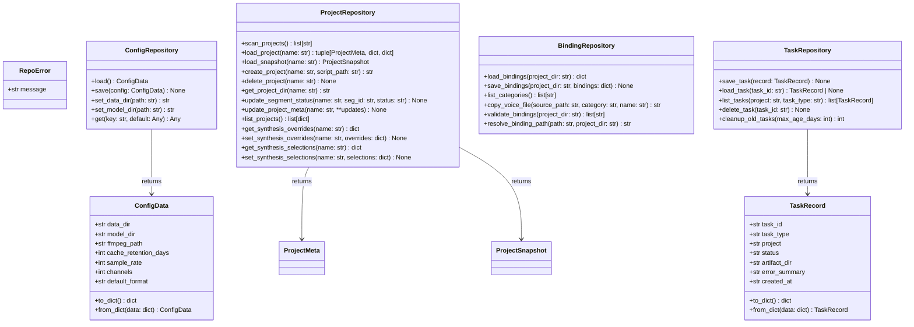
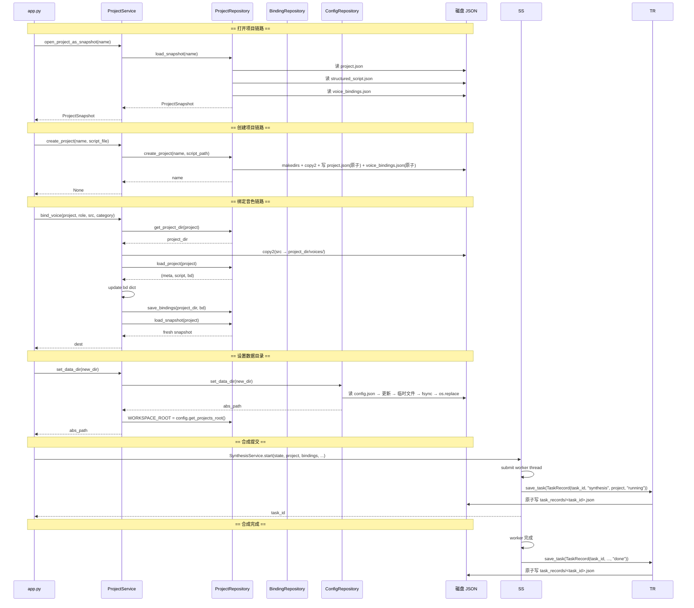
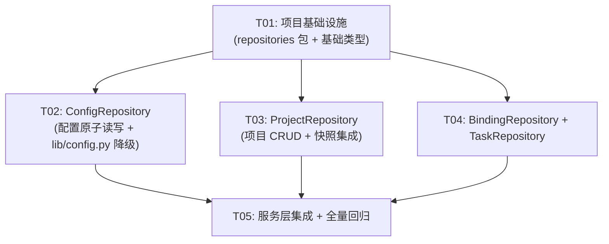

# 阶段四：Repository 层收拢 — 系统设计 + 任务分解

## Part A: System Design

### 1. Implementation Approach

**核心挑战**：lib/project_manager.py 500+ 行混合了「原始 JSON 读/写 + 业务查询 + 数据格式转换」，且写入操作未全部使用原子写。app.py 和多个 service 直接调用 pm.* 的磁盘函数，耦合紧密。

**分层策略**：引入 `repositories/` 层作为唯一的持久化边界，采用 **Repository Pattern**：

```
app.py → services/*.py → repositories/*.py (NEW) → 磁盘 JSON
                         ↑
                  lib/config.py (降级为 ConfigRepository 的薄包装，向后兼容)
```

- `repositories/` 只依赖标准库 + `lib/types.py` + `lib/snapshot.py`（快照引用），**不反向依赖** `services/` 或 `app.py`
- 新增 repo，不改已有测试红线（除非明确标注）
- 旧 `lib/project_manager.py` 保留不动（向后兼容），但阶段四结束后其直接磁盘调用归零

**API 设计风格**：
- Repository 方法均用 `@staticmethod` 或模块级函数（无实例状态，与既有的 `ProjectService` 风格一致）
- 写入 JSON 全部使用 **临时文件 + fsync + os.replace** 原子替换
- 错误处理：文件不存 → `FileNotFoundError`，JSON 损坏 → 明确的异常信息（不含 `except Exception: pass`）
- 核心操作直接 raise 明确异常；未形成调用链的 `OperationResult` 原型已退役

### 2. File List

```
repositories/
  __init__.py              # 包导出 + 错误码常量
  project_repo.py          # ProjectRepository — 项目 CRUD + meta 原子写
  config_repo.py           # ConfigRepository — 配置读写 + 原子写
  binding_repo.py          # BindingRepository — 绑定业务逻辑（非 I/O）
  task_repo.py             # TaskRepository — 项目内 SQLite 任务状态
  quality_repo.py          # Revision / QA / Repair / Export / Manifest

修改的文件：
  lib/config.py            # ConfigData 改为引用 ConfigRepository（向后兼容包装）
  services/project.py      # pm.* → ProjectRepository.*
  services/production_runtime.py # OS 单实例锁 + 唯一 TTS worker
  services/synthesis.py    # runtime 私有的段边界状态机
  services/supplement.py   # 通过 runtime utility task 补录

新增测试文件：
  tests/test_config_repo.py
  tests/test_project_repo.py
  tests/test_binding_repo.py
  tests/test_task_repo.py
```

**不修改**（保留旧文件供参考，但调用方迁移后不再使用）：
- `lib/project_manager.py`（保留，但不再被任何代码直接调用）
- `lib/voice_lib.py`（业务查询不变，不受影响）
- `lib/progress.py`（业务查询不变，不受影响）
- `lib/snapshot.py`（不受影响，被 ProjectRepository 引用）

### 3. Data Structures and Interfaces



#### 3.1 ConfigRepository (`repositories/config_repo.py`)

```python
@dataclass(frozen=True)
class ConfigData:
    """配置数据 dataclass（frozen，不可变）。"""
    data_dir: str = ""
    model_dir: str = ""
    ffmpeg_path: str = ""
    cache_retention_days: int = 7
    sample_rate: int = 24000
    channels: int = 1
    default_format: str = "wav"

    def to_dict(self) -> dict: ...
    @staticmethod
    def from_dict(data: dict) -> "ConfigData": ...

class ConfigRepository:
    CONFIG_PATH: ClassVar[str]  # = os.path.join(PROGRAM_DIR, "config.json")

    @staticmethod
    def load() -> ConfigData:
        """读 config.json，缺省返回默认 ConfigData。"""
        ...

    @staticmethod
    def save(config: ConfigData) -> None:
        """原子写 config.json：临时文件 → fsync → os.replace。"""
        ...

    @staticmethod
    def set_data_dir(path: str) -> str:
        """设置并持久化 data_dir（读取旧配置 → 更新 → 原子写）。"""
        ...

    @staticmethod
    def get(key: str, default: Any = None) -> Any:
        """读取 raw config.json 的单键（兼容 lib/config.py 既有调用方）。"""
        ...
```

#### 3.2 ProjectRepository (`repositories/project_repo.py`)

```python
class ProjectRepository:
    WORKSPACE_ROOT: ClassVar[str]
    LEGACY_ROOT: ClassVar[str]

    @staticmethod
    def _resolve_dir(name: str) -> str: ...

    @staticmethod
    def _meta_path(project_dir: str) -> str: ...
    @staticmethod
    def _load_meta(project_dir: str) -> ProjectMeta: ...
    @staticmethod
    def _save_meta(project_dir: str, meta: ProjectMeta) -> None:
        """原子写 project.json (tmp + fsync + os.replace)。"""

    @staticmethod
    def scan_projects() -> list[str]: ...
    @staticmethod
    def load_project(name: str) -> tuple[ProjectMeta, dict, dict]:
        """加载 (meta, script, voice_bindings)。"""
    @staticmethod
    def load_snapshot(name: str) -> "ProjectSnapshot": ...
    @staticmethod
    def create_project(name: str, script_path: str) -> str: ...
    @staticmethod
    def delete_project(name: str) -> None: ...
    @staticmethod
    def get_project_dir(name: str) -> str: ...

    @staticmethod
    def update_segment_status(name: str, seg_id: str, status: str) -> None:
        """读 meta → 更新单段 → 重新计数 → 原子写。"""
        ...

    @staticmethod
    def list_projects() -> list[dict]: ...
    @staticmethod
    def get_remaining(name: str) -> list[str]: ...

    # synthesis_overrides.json
    @staticmethod
    def get_synthesis_overrides(name: str) -> dict: ...
    @staticmethod
    def set_synthesis_overrides(name: str, overrides: dict) -> None:
        """原子写 synthesis_overrides.json。"""

    # synthesis_selections.json
    @staticmethod
    def get_synthesis_selections(name: str) -> dict: ...
    @staticmethod
    def set_synthesis_selections(name: str, selections: dict) -> None:
        """原子写 synthesis_selections.json。"""
```

**与 `lib/project_manager.py` 的关系**：`ProjectRepository` 是 `pm` 的"重构版"，函数签名几乎一一对应。旧 `pm` 保留，但 `ProjectService` 改为调用 `ProjectRepository`。

#### 3.3 BindingRepository (`repositories/binding_repo.py`)

```python
class BindingRepository:
    @staticmethod
    def load_bindings(project_dir: str) -> dict:
        """读 project_dir/voice_bindings.json，返回完整 dict。"""

    @staticmethod
    def save_bindings(project_dir: str, bindings: dict) -> None:
        """原子写 project_dir/voice_bindings.json。
        
        bindings dict 结构：{bindings: {role: path, ...}, 
                             role_categories: {role: cat, ...},
                             bound_at: str, verified: list}
        """

    @staticmethod
    def list_categories() -> list[str]:
        """从 voice_library 目录扫描文件名前缀推导分类（复用 voice_lib._category_of）。"""

    @staticmethod
    def copy_voice_file(source_path: str, name: str, category: str = "") -> str:
        """复制音频到 voice_library，按分类前缀命名；返回目标路径。"""

    @staticmethod
    def validate_bindings(project_dir: str) -> list[str]:
        """检查 voice_bindings.json 中所有绑定音频路径是否存在，返回缺失列表。"""

    @staticmethod
    def resolve_binding_path(path: str, project_dir: str) -> str:
        """统一化绑定路径：相对路径 → project_dir 绝对路径；已绝对 → 直接返回。"""
```

**边界**：
- `BindingRepository` 不直接操作磁盘 JSON（`voice_bindings.json` 的 I/O 归 `ProjectRepository`），但提供 `load_bindings`/`save_bindings` 快捷方法（内部调 `ProjectRepository` 的帮助函数）
- 或者更干净的方案：BindingRepository 只做业务逻辑（分类扫描/文件复制/校验），完全不碰 `voice_bindings.json`。`save_bindings` 放在 `ProjectRepository`，因为写 `project_dir` 下的文件是 Project 的职责。

**最终决策**：`BindingRepository` **不做** `voice_bindings.json` 的 I/O（归 `ProjectRepository`），只做：
- `list_categories()` — 扫描 voice_library
- `copy_voice_file()` — 复制到 voice_library
- `validate_bindings(bindings_dict)` — 纯函数校验绑定表
- `resolve_binding_path()` — 路径标准化

#### 3.4 TaskRepository (`repositories/task_repo.py`)

```python
@dataclass
class TaskRecord:
    task_id: str
    task_type: str  # "synthesis" | "supplement"
    project: str
    status: str     # "pending" | "running" | "done" | "cancelled" | "error"
    artifact_dir: str = ""
    error_summary: str = ""
    created_at: str = ""  # ISO 8601

    def to_dict(self) -> dict: ...
    @staticmethod
    def from_dict(data: dict) -> "TaskRecord": ...

class TaskRepository:
    @staticmethod
    def get_task_dir() -> str:
        """任务状态 JSON 根目录：<preview_dir>/task_records/"""

    @staticmethod
    def save_task(record: TaskRecord) -> None:
        """原子写 <task_dir>/<task_id>.json。"""

    @staticmethod
    def load_task(task_id: str) -> TaskRecord | None: ...

    @staticmethod
    def list_tasks(project: str = None, task_type: str = None) -> list[TaskRecord]: ...

    @staticmethod
    def delete_task(task_id: str) -> None: ...

    @staticmethod
    def cleanup_old_tasks(max_age_days: int = 7) -> int:
        """删除超期任务记录（按 created_at）。"""
```

**范围界定**（重要）：TaskRepository 仅保存**可序列化的轻量任务状态**：
- 合成任务：task_id, project, status (pending/running/done/cancelled/error), error_summary
- 补录任务：task_id, project, status, error_summary
- **不保存** Future/线程/SynthesisState（内存态不落盘）
- **不保存** 段级粒度（只到任务级）
- 用途：程序重启后识别「上次有哪些任务在跑、什么状态」，供 UI 恢复显示

### 4. Program Call Flow



### 5. Anything UNCLEAR

1. **voice_bindings.json 归属**：已在上面明确为「I/O 归 ProjectRepository，业务逻辑归 BindingRepository」。实现时 `ProjectRepository` 提供 `load_bindings`/`save_bindings`（原子写），`BindingRepository` 不碰 I/O。

2. **WORKSPACE_ROOT 模块级可变变量**：`pm.WORKSPACE_ROOT` 当前通过 `monkeypatch.setattr` 在测试中覆盖。重构后 `ProjectRepository.WORKSPACE_ROOT` 同样需要可被 monkeypatch。保持模块级变量不改为实例变量。

3. **config.py 迁移策略**：保留 `lib/config.py` 的全局函数作为 `ConfigRepository` 的向后兼容包装。例如 `lib/config.py` 的 `set_data_dir(d)` 内部调 `ConfigRepository.set_data_dir(d)`。阶段四结束时允许两套共存，但建议在后续阶段移除 lib/config.py 的直接调用。

4. **TaskRepository 与现有 SupplementService.cleanup_old_tasks 的关系**：现有 `supplement.py` 已有一个 `cleanup_old_tasks` 清理缓存目录。新 `TaskRepository.cleanup_old_tasks` 是清理任务状态 JSON，两者是并行关系（一个清理缓存 wav，一个清理状态记录）。

5. **红线 AST 测试**：`app.py` handler 的参数签名不变（`bind_voice` 等不改参数量和类型），因此红线不受影响。仅 `services/project.py` 内部实现从 `pm.*` 改为 `ProjectRepository.*`，对外接口不变。

---

## Part B: Task Decomposition

### 6. Required Packages

无新增第三方依赖。全部使用标准库：
- `os`, `json`, `shutil`, `time`, `logging`, `dataclasses`, `typing`

### 7. Task List (ordered by dependency)

#### T01: 项目基础设施 — repositories 包结构 + 基础类型

| 字段 | 内容 |
|------|------|
| **Task ID** | T01 |
| **Task Name** | 项目基础设施：创建 repositories 包、ConfigData/TaskRecord 数据类、错误码 |
| **Source Files** | `repositories/__init__.py`, `repositories/exceptions.py`, `repositories/config_repo.py`（含 ConfigData），可选的 `repositories/base.py` |
| **Dependencies** | 无 |
| **Priority** | P0 |

**做什么**：
1. 创建 `repositories/` 包目录和 `__init__.py`，导出所有 Repository 类
2. 创建 `repositories/exceptions.py`，定义：
   - `RepoError(Exception)` — 基础异常
   - `ProjectNotFoundError(RepoError)`
   - `ConfigCorruptedError(RepoError)`
   - `AtomicWriteError(RepoError)`
3. 在 `repositories/config_repo.py` 中定义 `ConfigData` dataclass（见接口设计）
4. 在 `repositories/task_repo.py` 中定义 `TaskRecord` dataclass（见接口设计）
5. 提供 `atomic_write(path, data_fn)` 通用工具函数（写入临时文件 + fsync + os.replace）

**关键实现细节**：
```python
# repositories/__init__.py
from .config_repo import ConfigRepository, ConfigData
from .project_repo import ProjectRepository
from .binding_repo import BindingRepository
from .task_repo import TaskRepository, TaskRecord

# atomic_write 工具
def atomic_write(path: str, data: dict) -> None:
    """原子写 JSON：临时文件 → fsync → os.replace"""
    tmp = path + ".tmp"
    with open(tmp, "w", encoding="utf-8") as f:
        json.dump(data, f, ensure_ascii=False, indent=2)
        f.flush()
        os.fsync(f.fileno())
    os.replace(tmp, path)
```

#### T02: ConfigRepository — 配置原子读写 + lib/config.py 降级

| 字段 | 内容 |
|------|------|
| **Task ID** | T02 |
| **Task Name** | ConfigRepository：配置原子读写 + ConfigData + lib/config.py 降级包装 |
| **Source Files** | `repositories/config_repo.py`（实现），`lib/config.py`（重构），`tests/test_config_repo.py` |
| **Dependencies** | T01 |
| **Priority** | P0 |

**做什么**：
1. 在 `repositories/config_repo.py` 实现 `ConfigRepository`（见接口设计）
   - `load()`：读 config.json → 缺省返回默认 ConfigData
   - `save(config)`：原子写（tmp + fsync + os.replace）
   - `set_data_dir(path)`：读取旧配置 → 更新 data_dir → 原子写 → 返回规范化路径
   - `get(key, default)`：轻量读单键（兼容 lib/config.py 既有调用方）
2. **重构 `lib/config.py`**：
   - `_read_config()` → 改为调 `ConfigRepository.load().to_dict()` 或保留原实现但保持行为一致
   - `set_data_dir(d)` → 改为调 `ConfigRepository.set_data_dir(d)`
   - 保持所有公有函数签名不变（向后兼容）
   - 注意：`config.json` 的路径（`CONFIG_PATH`）仍由 `lib/config.py` 计算
3. 新增 `tests/test_config_repo.py`：
   - 测试原子写（写入中途崩溃不损坏已有文件）
   - 测试 ConfigData 序列化/反序列化
   - 测试 load() 缺省值
   - 测试 set_data_dir 持久化

#### T03: ProjectRepository — 项目 CRUD + ���子写 meta + 快照集成

| 字段 | 内容 |
|------|------|
| **Task ID** | T03 |
| **Task Name** | ProjectRepository：项目 CRUD、原子写 project.json、快照加载 |
| **Source Files** | `repositories/project_repo.py`，`tests/test_project_repo.py`，`services/project.py`（修改） |
| **Dependencies** | T01 |
| **Priority** | P0 |

**做什么**：
1. 在 `repositories/project_repo.py` 实现 `ProjectRepository`（见接口设计）
   - 将 `lib/project_manager.py` 中所有磁盘操作逐方法复制并改为使用原子写
   - `_save_meta` 使用 atomic_write 工具
   - `load_snapshot` 调用 `load_project` + `ProjectSnapshot.build`
   - 新增 `save_bindings(project_dir, bindings)` — 原子写 voice_bindings.json
   - 新增 `load_bindings(project_dir)` — 读 voice_bindings.json
   - `set_synthesis_overrides` / `set_synthesis_selections` 改为原子写
   - 保留 `WORKSPACE_ROOT` / `LEGACY_ROOT` 模块级变量（测试 monkeypatch 兼容）
2. **修改 `services/project.py`**：
   - `ProjectService.scan_projects()` → 调 `ProjectRepository.scan_projects()`
   - `ProjectService.create_project()` → 调 `ProjectRepository.create_project()`
   - `ProjectService.open_project()` → 调 `ProjectRepository.load_project()`
   - `ProjectService.open_project_as_snapshot()` → 调 `ProjectRepository.load_snapshot()`
   - `ProjectService.list_projects()` → 调 `ProjectRepository.list_projects()`
   - `ProjectService.delete_project()` → 调 `ProjectRepository.delete_project()`
   - `ProjectService.get_project_dir()` → 调 `ProjectRepository.get_project_dir()`
   - `ProjectService.update_segment_status()` → 调 `ProjectRepository.update_segment_status()`
   - `ProjectService.set_data_dir()` → 调 `ConfigRepository.set_data_dir()` + 更新 `WORKSPACE_ROOT`
   - `ProjectService.bind_voice()` → 音色复制逻辑不变，但写 voice_bindings.json 改为调 `ProjectRepository.save_bindings()`
3. 新增 `tests/test_project_repo.py`：
   - 测试 scan/create/load/delete 完整链路
   - 测试原子写（模拟写入中断）
   - 测试 update_segment_status 重新计数
   - 测试 legacy 目录兼容（旧项目可打开）
   - 测试 load_snapshot 快照构建

#### T04: BindingRepository + TaskRepository

| 字段 | 内容 |
|------|------|
| **Task ID** | T04 |
| **Task Name** | BindingRepository（音色分类/校验/复制） + TaskRepository（轻量任务状态持久化） |
| **Source Files** | `repositories/binding_repo.py`，`repositories/task_repo.py`，`tests/test_binding_repo.py`，`tests/test_task_repo.py` |
| **Dependencies** | T01 |
| **Priority** | P1 |

**做什么**：
1. **BindingRepository**（`repositories/binding_repo.py`）：
   - `list_categories()` — 扫描 `config.get_voice_library()` 目录，调用 `voice_lib._category_of` 推导分类（不直接读取 `voice_lib` 模块依赖，仅复用文件名规则）
   - `copy_voice_file(source_path, name, category)` — 复制到 voice_library，前缀 `{category}_{name}`，返回目标路径
   - `validate_bindings(project_dir)` — 读 `voice_bindings.json` 的 `bindings` 键 → 检查每个 path 是否存在 → 返回缺失列表
   - `resolve_binding_path(path, project_dir)` — path 已绝对则原样返回；相对则拼接 `project_dir` 返回
   
2. **TaskRepository**（`repositories/task_repo.py`）：
   - 正式任务存于项目 `01_项目配置/production_tasks.sqlite3`
   - `BEGIN IMMEDIATE` + partial unique index 保证项目 active 唯一
   - 幂等键在事务内比较规范化 scope/options；不同 payload 返回冲突
   - owner、heartbeat、control intent、version、日志与 attempt history 持久化
   - 旧 `<preview>/task_records/*.json` 只读导入，补录测试夹具保持兼容
   - cleanup 只删除过期 terminal rows，绝不删除 active/recovery task

3. 新增测试：
   - `tests/test_binding_repo.py`：分类扫描、文件复制、绑定校验
   - `tests/test_task_repo.py`：save/load/list/delete/cleanup 全链路

#### T05: 单例 runtime + 补录/合成任务状态接入 + 全量回归

| 字段 | 内容 |
|------|------|
| **Task ID** | T05 |
| **Task Name** | 服务层集成：合成/补录任务状态写入 TaskRepository + app.py 验证 + 全量回归 |
| **Source Files** | `services/synthesis.py`（修改），`services/supplement.py`（修改），`app.py`（验��不改），`services/project.py`（已在 T03 改完） |
| **Dependencies** | T02, T03, T04 |
| **Priority** | P1 |

**做什么**：
1. **`services/production_runtime.py` + `services/synthesis.py`**：
   - runtime 全生命周期持有跨平台 OS 文件锁，只有 lock owner 能判 interrupted
   - Web/MCP 只写 SQLite command；worker 持久化 heartbeat、进度和终态
   - pause/cancel 先写 intent，worker 在段边界确认 paused/cancelled
   
2. **`services/runtime_tts.py` + `services/supplement.py`**：
   - 试听与补录也进入同一 runtime 队列，Web 不 import/init TTS
   - 音频先写唯一 `.part.wav`，校验后原子发布到项目 cache
   
3. **验证 `app.py`**：
   - 确认所有 handler 的 `pm.*` 直接调用已经通过 `ProjectService` 间接走 `ProjectRepository`
   - 确认 `config.*` 调用仍然工作（lib/config.py 向后兼容）
   - 确认红线 AST 测试不破裂
   
4. **全量回归**：
   - 运行 `pytest tests/` 验证 343+ passed
   - 检查无 `except Exception: pass` 模式引入新问题
   - 确认 3 failed / 19 skipped 未增加

### 8. Shared Knowledge

- **原子写规范**：所有 JSON 写入必须使用 `tmp_path + ".tmp"` 作为临时文件 → 写入 → `f.flush()` → `os.fsync(f.fileno())` → `os.replace(tmp_path, path)`。`os.replace` 在**同一文件系统**内是原子操作。所有配置文件（config.json, project.json, voice_bindings.json, task JSON）都在 data_dir 内，天然同盘。
- **Repository 不反向依赖 Services**：`repositories/` 只能依赖标准库 + `lib/types.py` + `lib/snapshot.py`。不得 import `services/` 或 `app.py`。
- **WORKSPACE_ROOT monkeypatch**：`ProjectRepository.WORKSPACE_ROOT` 是模块级变量，测试通过 `monkeypatch.setattr(ProjectRepository, "WORKSPACE_ROOT", str(tmp_path))` 覆盖。
- **向后兼容原则**：`lib/config.py` 和 `lib/project_manager.py` 保留不动（函数签名不变），但新增代码不走它们直接调磁盘。
- **`ProjectService.set_data_dir()` 特殊处理**：当前它会设置 `pm.WORKSPACE_ROOT`，T03 后改为设置 `ProjectRepository.WORKSPACE_ROOT`。同时考虑是否也需要更新 `lib/config` 的 `WORKSPACE_ROOT`？不需要——旧 pm 已不被调用，留空即可。
- **异常向上传递**：Repository 层抛出明确异常（`FileNotFoundError`, `json.JSONDecodeError`, `RepoError`），Service 层负责捕获并转换为 UI 层可展示的消息。不允许 `except Exception: pass`。

### 9. Task Dependency Graph



---

## 迁移策略总结

### 旧直接调用映射表

| 旧调用 | 调用方 | 旧走向 | 新走向 |
|--------|--------|--------|--------|
| `pm.scan_projects()` | `ProjectService.scan_projects()` | `lib/project_manager.py` | `ProjectRepository.scan_projects()` |
| `pm.create_project()` | `ProjectService.create_project()` | `lib/project_manager.py` | `ProjectRepository.create_project()` |
| `pm.open_project()` | `ProjectService.open_project()` | `lib/project_manager.py` | `ProjectRepository.load_project()` |
| `pm.load_snapshot()` | `ProjectService.open_project_as_snapshot()` | `lib/project_manager.py` | `ProjectRepository.load_snapshot()` |
| `pm.delete_project()` | `ProjectService.delete_project()` | `lib/project_manager.py` | `ProjectRepository.delete_project()` |
| `pm.get_project_dir()` | `ProjectService.get_project_dir()` | `lib/project_manager.py` | `ProjectRepository.get_project_dir()` |
| `pm.update_segment_status()` | `ProjectService.update_segment_status()` | `lib/project_manager.py` | `ProjectRepository.update_segment_status()` |
| `pm.list_projects()` | `ProjectService.list_projects()` | `lib/project_manager.py` | `ProjectRepository.list_projects()` |
| `pm.bind_voice` 内的`voice_bindings.json`写 | `ProjectService.bind_voice()` | 直接 json.dump | `ProjectRepository.save_bindings()` |
| `config.set_data_dir()` | `ProjectService.set_data_dir()` | `lib/config.py`→json.dump | `ConfigRepository.set_data_dir()`（lib/config 包装） |
| `pm.get_synthesis_overrides()` | app.py `do_synthesis` 内 | `lib/project_manager.py` | `ProjectRepository.get_synthesis_overrides()` |
| `pm.set_synthesis_overrides()` | app.py `do_synthesis` 内 | `lib/project_manager.py`→json.dump | `ProjectRepository.set_synthesis_overrides()`（原子写） |
| `pm.get_synthesis_selections()` | app.py `render_preview` 内 | `lib/project_manager.py` | `ProjectRepository.get_synthesis_selections()` |
| `pm.set_synthesis_selections()` | app.py `do_synthesis` 内 | `lib/project_manager.py`→json.dump | `ProjectRepository.set_synthesis_selections()`（原子写） |
| `build_role_choices()` | `ui/components/voice_binding.py::format_role_choices` | `ui/components/voice_binding.py`（纯展示函数） | UI-owned category/value choices |
| `build_bound_role_choices()` | `ui/components/voice_binding.py::format_bound_role_choices`、`app.py::refresh_supplement_roles` | `ui/components/voice_binding.py`（纯展示函数） | UI-owned bound-role choices |
| `Project View.render_chapter_tree()` | app.py 打开/归档刷新链 | `ui/project_view_handlers.py`（UI HTML + `ProjectService.open_project()`） | → `ProjectService.open_project()` + 章节树 HTML |
| `pm.WORKSPACE_ROOT` | `ProjectService.set_data_dir()` | 模块级变量 | `ProjectRepository.WORKSPACE_ROOT` |

### "改移" vs "保持" vs "双写"

| 分类 | 条件 | 做法 |
|------|------|------|
| **改移** | Service 层调用 | T03/T05 直接改调用目标 |
| **保持旧包装** | `lib/config.py` 的公有函数（可能被 launcher.py 等外部调用） | 内部实现改为调 ConfigRepository，签名不变 |
| **UI presentation helper** | `build_role_choices()`, `build_bound_role_choices()` | 迁移到 `ui/components/voice_binding.py`；不进入 `ProjectRepository` 或 `project_manager` |

---

## 测试策略

| 测试文件 | 内容 | 关键用例 |
|----------|------|----------|
| `tests/test_config_repo.py` | ConfigRepository 单测 | 原子写完整性、损坏 json 恢复、set_data_dir 持久化、缺省值 |
| `tests/test_project_repo.py` | ProjectRepository 单测 | scan/create/load/delete 全链路、update_segment_status 计数、legacy 兼容、loopback 快照 |
| `tests/test_binding_repo.py` | BindingRepository 单测 | 分类扫描（tmp voice_library）、文件复制、绑定校验（模拟丢失路径）、路径标准化 |
| `tests/test_task_repo.py` | TaskRepository 单测 | save/load/list/delete、按 project/task_type 过滤、cleanup 过期清理、JSON 损坏容错 |
| 回归（不动） | 现有 343 tests | 阶段四结束后全量 `pytest tests/` 仍 343+ passed / 3 failed / 19 skipped |

### 安装依赖

无新增依赖。测试使用 `pytest` 已有、`tmp_path` fixture、`monkeypatch`。

---

## 风险清单

| # | 风险 | 影响 | 规避措施 |
|---|------|------|----------|
| R1 | **原子写跨盘失败**：`os.replace(tmp, path)` 在 tmp 和 path 不在同一文件系统时报 `OSError` | 配置/项目数据损坏 | 所有 tmp 文件在同一目录（`path + ".tmp"`），天然同盘。确认 config.json 与 program dir 同盘；project.json 与 project dir 同盘。 |
| R2 | **config.py 被多处直接调用**（app.py:key-up, launcher.py, lib/ 内各模块） | 切换中间态时 config 行为不一致 | `lib/config.py` 保持所有公有函数签名不变，内部实现改为委托 `ConfigRepository`。不存在"两套"——始终是 `lib/config.py` 调 `ConfigRepository`。 |
| R3 | **阶段三快照加载入口依赖 services/project.py**，T03 改了打开逻辑 | 快照加载与项目打开不同步 | `ProjectRepository.load_snapshot()` 内部调 `load_project()` + `ProjectSnapshot.build()`，与阶段三的 `pm.load_snapshot` 逻辑等价。`services/session.py` 的 `ensure_snapshot` / `reload_if_stale` 不需要改（快照类无变化）。 |
| R4 | **Project View 章节树的 I/O 与 HTML ownership** | Round 2A 已将章节树迁移到 `ui/project_view_handlers.py`，通过 `ProjectService.open_project()` 读取；`lib/project_manager.py` 不再包含 HTML renderer | 保持 `ProjectService.open_project()` 的兼容包装与既有章节树 HTML/状态契约；app 只保留 `.then(project_view_ui.render_chapter_tree, ...)` 接线。 |
| R5 | **测试隔离**：conftest.py 设置了 `AUDIOBOOK_STUDIO_DATA_DIR` 环境变量，但 `config_repo.py` 如何知道 CONFIG_PATH？ | ConfigRepository 写到了程序目录的 config.json 而非临时目录 | `ConfigRepository.CONFIG_PATH` 保持与 `lib/config.py` 一致（`os.path.join(PROGRAM_DIR, "config.json")`）。测试通过 `monkeypatch.setattr(ConfigRepository, "CONFIG_PATH", str(tmp_path / "config.json"))` 隔离。 |
