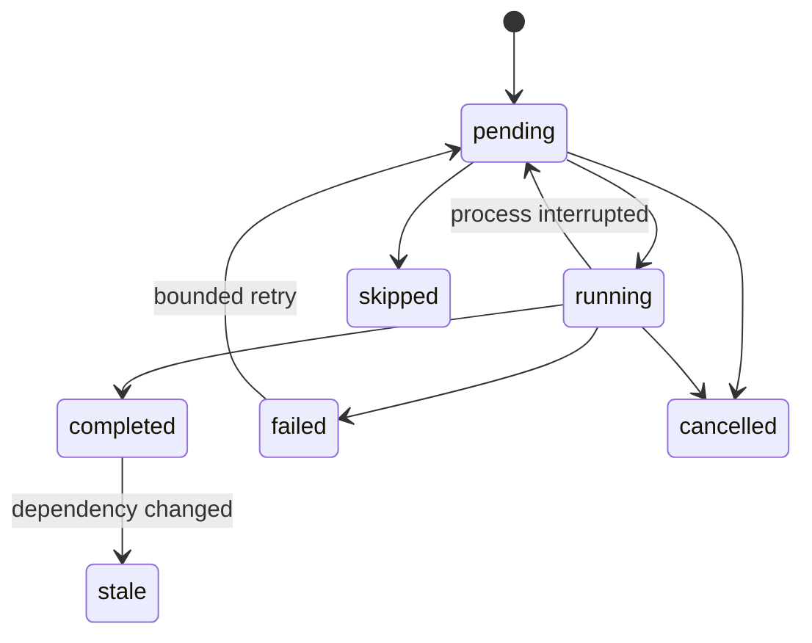
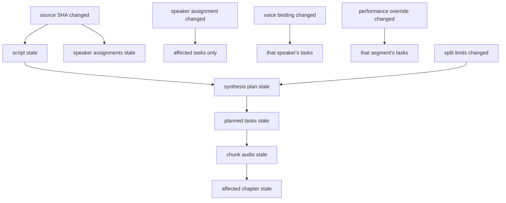

# Audiobook Studio v4 架构

## 核心原则

1. 原文是项目的不可变事实源。
2. 语义片段只引用原文坐标，不复制并悄然改写原文。
3. 角色路由只决定说话人，不承载 TTS 参数。
4. 合成计划是可版本化产物，合成任务是可重试运行时状态。
5. 高频状态进入 SQLite；可审阅、可版本控制的配置保留 JSON。
6. v3 与 v4 通过 schema 明确区分，迁移完成前 v3 默认路径不变。

## 分层

```text
Source import
  -> immutable source/source.txt + source.meta.json
  -> deterministic semantic segmentation
  -> script/script.json + speakers.json + character_candidates.json
  -> chapter character extraction + candidate review
  -> speaker router (Phase 2)
  -> synthesis planner (Phase 3)
  -> TTS adapter and runtime tasks (Phase 4)
  -> delivery
```

领域层不依赖 Gradio、AI SDK 或 IndexTTS2。服务层协调纯领域操作；仓储层负责磁盘和 SQLite；UI 只在后续阶段调用应用服务。

## 项目布局

```text
project.json
source/source.txt
source/source.meta.json
script/script.json
script/speakers.json
script/character_candidates.json
production/voices.json
production/performance.json
production/pronunciation.json
production/tts_profile.json
runtime/runtime.db
runtime/character_extraction/checkpoints.json
runtime/benchmarks/
audio/chunks/
audio/chapters/
audio/previews/
output/
revisions/
```

项目创建同时写入空的候选文件；后续角色分析和生产文件由相应阶段创建。

## 接口边界

- `CharacterExtractor` 按章节输出严格的 `character-extraction-v1` 候选协议；候选包含置信度和原文证据，不直接创建 Speaker。
- `SpeakerRouter` 输入脚本与已确认说话人目录，输出 `speaker-routing-v2`；协议优先使用受限的 `speaker_id`，新人物只能返回候选名或 null。
- `TtsAdapter` 输入已规划任务和 TTS profile，输出音频结果；不读取 UI 状态。
- Phase 1 仅提供 Protocol 和 fake 实现测试边界，不连接远端服务。

## 安全与可恢复性

- 项目先写入同一父目录下的临时目录，所有核心文件和数据库成功后再原子发布。
- JSON 使用严格 schema/version 检查；原文使用 SHA-256 校验。
- SQLite migration 在事务中执行，任务状态有有限状态集合和父子拆分关系。
- 日志和错误不默认写入原文内容、API key 或本机绝对路径。

## 运行状态机



Phase 1 建立状态集合和“遗留 running → pending”的事务恢复。任务执行、有限重试和 OOM 子任务属于 Phase 4。

## 失效传播



| 变更 | 不失效 | 失效 |
|---|---|---|
| speaker assignment | source、其他 segment | 当前 segment 的 task/cache/chapter |
| voice binding | script、speakers、其他角色 | 该角色 task/cache/相关章节 |
| performance override | source、路由 | 相关 segment task/cache/chapter |
| source | 无旧坐标派生物可复用 | script、routing、plan、task、全部音频 |
| max token/character limit | source、script、routing | plan 与受影响 task |

Phase 1 只冻结这份 contract；局部失效执行器和测试在 Phase 3。

## 角色路由协议

`speaker-routing-v2` 的请求显式提供 `allowed_speakers[{speaker_id,name,aliases}]`。响应使用 `{segment_id,speaker_id,candidate_name,confidence}`；未知/重复 segment ID、未知 speaker ID、额外字段或非法置信度使批次失败。`speaker_id=null` 与低置信度均保持 unresolved；候选名只能写入候选区，不能直接创建 Speaker。请求可携带必要上下文，但 checkpoint 和错误日志不得复制整本书。

## TTS 规划、缓存和装配 contract

- Planner 按 paragraph、sentence、semicolon、comma、colon、safe character 的优先级拆分；接口同时容纳 characters、tokens、phonemes、estimated seconds 和 engine-specific limits。
- 连续短片段只有在同章节、同 speaker/voice/performance、无 unresolved/强制边界且不超限时才能合并。
- Cache key 由 engine/model/voice fingerprint/actual text/pronunciation/performance/synthesis settings/seed 组成，不使用 task ID 代替实际输入。
- Cache entry 必须同时验证文件存在和 SHA；失败即 invalid。
- Chapter assembler 校验采样率/声道，按 task 顺序统一格式；continuation 使用短停顿，角色/段落/章节边界使用不同停顿，可选短 crossfade。
- OOM 只拆分当前 task：释放临时对象、必要时 GC/CUDA cache、受限递归生成子任务；不重跑成功任务，不重载每个片段的模型，GPU 默认并发 1。

## v4 UI 目标流程

`导入书稿 → 角色识别 → 待确认片段 → 角色与声音 → TTS 设置 → 合成队列 → 试听质检 → 导出`

Phase 1 不接 UI。Phase 2 加角色审核，Phase 3 加计划预览，Phase 4 加任务队列，Phase 5 完成默认入口与导出迁移。

## 测试策略

- 领域层：序列化、schema/hash/bounds/overlap、锁定与 unresolved。
- 导入层：编码、容器损坏、换行规范化、长文本和 hash。
- 仓储层：原子发布、故障注入、重复目录、Windows 路径、migration。
- 后续 contract：routing 批次隔离、invalidation 局部性、planner 拆并、OOM 父子任务、cache 文件校验、音频格式装配。
- 每个阶段必须同时跑 v3 全仓回归，切换默认入口前增加 v3/v4 双读与回滚测试。
