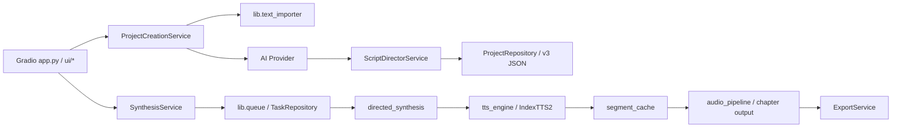

# Audiobook Studio 当前架构审计

## 范围与结论

本审计以 v3.3.3 `main` 为基线。当前系统把导入、AI 剧本分析、角色绑定、合成队列和交付状态耦合在同一项目模型中。v4 不直接改写这条稳定链路，而是在旁路建立 source-first 数据层，待迁移工具和兼容验证完成后再切换默认入口。

## 当前调用链

项目创建：

`app.py` → `ui/create_project_handlers.py` → `services/project_creation.py` → `lib/text_importer.py` → AI provider → `services/script_director.py` → `repositories/project_repo.py`

TTS：

`app.py` → `services/synthesis.py` → `lib/queue.py` → `lib/directed_synthesis.py` → `lib/tts_engine.py` → IndexTTS2 `infer`

当前项目以 `project.json`、`structured_script.json`、`voice_bindings.json` 和若干音频目录为核心。任务状态主要保存在 JSON 中；文本经过分析后成为脚本，但缺少不可变原文、原文坐标和独立的语义片段层。

## 可复用能力

- `lib/text_importer.py`：TXT、DOCX、EPUB 的安全读取和基础规范化。
- `repositories/project_repo.py`：临时目录加原子替换的项目创建思路。
- `repositories/_atomic.py`：JSON 原子写入模式。
- `lib/audio_pipeline.py`：音频格式统一、拼接和静音处理概念。
- `lib/tts_engine.py`：IndexTTS2 延迟初始化、常驻实例、签名探测和显存清理经验。

## 需要适配或退役的耦合

- 创建项目必须先调用 AI，导致离线导入和失败恢复受远端服务影响。
- `structured_script.json` 同时承担文本解释、角色路由和生产输入职责。
- 任务状态写入项目 JSON，频繁更新会放大竞争和损坏风险。
- TTS OOM 回退按字符中点拆分，未以独立、可追踪任务表达父子关系。
- 部分错误信息包含原文片段；v4 运行时错误默认只记录标识和分类。

## UI、缓存与导出依赖

- Gradio 事件直接组织 v3 project、voice binding、queue 和 export 服务；因此 Phase 1 不给 UI 接入 v4 reader，避免把半成品设为默认。
- `lib.segment_cache` 的 key 与 v3 segment/director 元数据绑定，不能直接成为 v4 cache contract。
- `lib.audio_pipeline` 和导出服务依赖既有章节产物路径；其音频规范化能力可复用，但输入应在 Phase 4 改为 plan/task 顺序。

## v4 影响范围

| 范围 | Phase 1 | 后续阶段 |
|---|---|---|
| `domain/v4`, `schemas/v4` | 新增严格模型 | 扩展 routing/plan |
| source import/segmenter | 新增旁路服务 | 加规则置信度和 router |
| v4 repository/runtime DB | 新增 | 队列、缓存、失效 |
| AI providers | 不改 | Phase 2 adapter |
| TTS/audio/export | 不改 | Phase 4/5 adapter |
| `app.py`, Gradio pages | 不改 | Phase 5 切换 |

## 风险清单

- 标准化规则变化会使全部原文坐标失效；normalization version 必须冻结。
- 中文引号、嵌套引号和提示语规则存在误判风险；不确定结果必须 unresolved。
- Windows 文件占用可能让原子目录发布失败；失败时临时目录必须清理，目标目录不得出现。
- SQLite migration 中断可能产生半升级；每个 migration 必须单事务。
- v3/v4 schema 误判会打开错误 reader；入口必须先检查 `schema_version`。
- 未经真实 Windows benchmark 的 TTS 限制不能标记为 verified。

## v4 边界

Phase 1 只新增文档、模型、导入、确定性分段、原子仓储和 SQLite 运行时骨架。不会接入真实 AI、真实 TTS、现有 UI 或默认 v3 创建流程。
