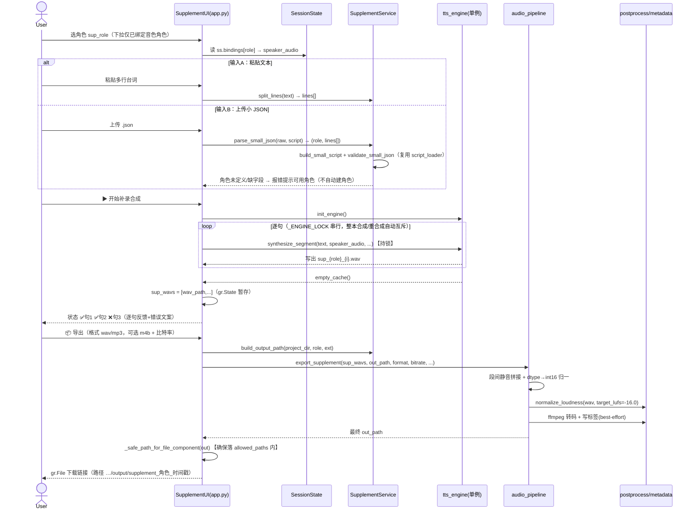

# 系统设计：角色单独补录 / 补合成导出（补录合成）

> 对应功能：有声书合成工作台新增「补录合成」导航分区。
> 阶段：标准 SOP 的架构师（高见远）系统设计 + 任务分解 —— 纯设计产出对应代码已实现并验证。

---

## 1. 实现方案 + 框架选型

**技术栈**：沿用现有 Gradio + IndexTTS2 技术栈，**不引入任何新框架 / 新依赖**。

**核心策略 = 严格增量、复用优先**：
- 单段合成 → 复用 `lib/tts_engine.py::synthesize_segment`（现有全局单例 `_tts`）。
- 拼接 + LUFS 归一 + ffmpeg 转码 → 复用 `lib/audio_pipeline.py` + `lib/postprocess.py` + `lib/metadata.py`。
- 小 JSON 校验 → 复用 `lib/script_loader.py::from_dict` + `validate_script`（别名容错 + 诊断）。
- 下载白名单 → 复用 `app.py::_safe_path_for_file_component`（保证 `gr.File` 落在 `allowed_paths` 内）。

**新增面（最小化）**：
1. `lib/audio_pipeline.py` 新增薄封装 `export_supplement(...)`：段间静音拼接 → dtype→int16 → `normalize_loudness` → ffmpeg 转码 → best-effort 写标签；**不依赖整本 script**，只接收 wav 路径列表。
2. `services/supplement.py`（NEW，纯逻辑、无 Gradio、可单测）：文本按行拆分、小 JSON 包成 Script 校验、逐句合成编排、导出路径生成。把编排逻辑从 `app.py` 抽离，保持 UI 层薄、可测（与现有 `services/*` 架构一致）。
3. `app.py` 新增独立导航项「补录合成」（Tab / Group），插入在 `grp_synth` 与 `grp_review` 之间。

**新增导航项如何融入现有 nav Group 体系**（对齐 `app.py`）：
- 在 `grp_synth` 之后新增 `nav_supplement = gr.Button("补录合成", elem_classes=["nav-btn"], elem_id="nav-supplement")`。
- 在 `grp_synth` 与 `grp_review` 之间新增 `with gr.Group(visible=False, elem_id="grp-supplement") as grp_supplement:`。
- `_goto(which)` 的返回元组从 6 项扩为 7 项，新增 `gr.update(visible=(which == "supplement"))`（**仅改元组长度，不改既有 6 项顺序 / 语义**）。
- `_GROUPS` 列表追加 `grp_supplement`。
- `nav_supplement.click(lambda: _goto("supplement"), None, _GROUPS).then(refresh_supplement_roles, [ss], [sup_role])` —— 进入 Tab 时懒刷新角色下拉。

**引擎并发互斥方案（关键决策）**：
- 在 `lib/tts_engine.py` 模块级新增 `_ENGINE_LOCK = threading.RLock()` 与访问器 `engine_lock()`。
- 用 `with _ENGINE_LOCK:` 包裹 `init_engine()` 的模型加载块（防止两个线程同时首次加载导致双加载 / OOM），以及 `synthesize_segment()` **整个函数体**。
- **必须用 `RLock` 而非 `Lock`**：`synthesize_segment` 在 OOM 时会递归调用自身（同一线程重入），非重入锁会死锁；`RLock` 可重入，安全。
- 互斥是**单一真相源、自包含**：`synthesize_segment` 一旦持锁，所有调用方（整本 `lib/queue.py`、整本重合成 `app.py::regenerate_segment`、补录合成）自动串行互斥，**无需在各调用点再加锁**。

---

## 2. 文件列表（相对路径，标注 新增 / 修改）

**新增（NEW）**
- `services/supplement.py` — 补录编排服务（纯逻辑）：`split_lines` / `build_small_script` / `validate_small_json` / `parse_small_json` / `synthesize_lines` / `build_output_path`。
- `tests/test_supplement.py` / `tests/test_supplement_json.py` — 引擎锁、`build_bound_role_choices`、`export_supplement`、SupplementService 和 JSON 边界的 canonical pytest 回归（monkeypatch 哑 wav 桩）。
- `tests/test_supplement_wiring.py` — nav 按钮 / grp 显隐 / 接线存在（AST 风格，对齐 `test_app_wiring.py`）。
- `tests/test_script_loader_diagnostics.py` — 「剧本校验失败」诊断修复的 canonical pytest 回归。

**修改（MODIFY）**
- `lib/tts_engine.py` — 新增 `_ENGINE_LOCK`(`RLock`) + `engine_lock()`；`init_engine` 加载块与 `synthesize_segment` 整体包入 `with _ENGINE_LOCK:`；顶部 `import threading`。
- `ui/components/voice_binding.py` — `build_bound_role_choices(script, bindings) -> list[tuple]`（仅 `bindings.get(role)` 为真值的角色，标签前缀「【已绑定】」）。
- `lib/audio_pipeline.py` — 新增 `export_supplement(...)` 函数（复用 `SEG_SILENCE_SEC`、`postprocess`、`metadata`、`subprocess` ffmpeg 范式）。
- `app.py` — 新增 `nav_supplement` 按钮、`grp_supplement` Group 全部组件、`refresh_supplement_roles` / `do_supplement_parse_json` / `do_supplement_synth` / `do_supplement_export` / `play_supplement_preview` 等 handler、`gr.State`、`_goto` / `_GROUPS` 扩为 7 项、`.click` 接线。
- `services/__init__.py` — 导出 `SupplementService`。

> `ProjectService` 暂不改动（P0 不回写整本）；P2 如需回写再给 `ProjectService` 加 `write_supplement_segments`。

---

## 3. 数据结构与接口（关键签名）

```python
# lib/tts_engine.py（新增）
import threading
_ENGINE_LOCK = threading.RLock()          # 全局引擎互斥锁（重入，兼容 OOM 递归合成）
def engine_lock(): return _ENGINE_LOCK    # 访问器（如需显式使用）
# init_engine(): 在 `if _tts is not None: return` 之前包入 `with _ENGINE_LOCK:`
# synthesize_segment(...): 整个函数体包入 `with _ENGINE_LOCK:`

# ui/components/voice_binding.py（纯展示 helper）
def build_bound_role_choices(script: dict, bindings: dict) -> list[tuple]:
    """仅返回 bindings.get(role) 为真值的角色，(label, value) 元组，标签同 build_role_choices。"""

# lib/audio_pipeline.py（新增）
def export_supplement(
    paths: list[str], out_path: str,
    format: str = "mp3", bitrate: str = "192k",
    target_lufs: float = -16.0,
    insert_silence_sec: float = SEG_SILENCE_SEC,
    title: str | None = None, artist: str | None = None,
    album: str | None = None, cover_path: str | None = None,
) -> str:
    """拼接多段独立 wav → 段间静音 → dtype→int16 → normalize_loudness(LUFS)
    → ffmpeg 转码(mp3/m4b) → best-effort 写标签；不依赖整本 script。
    Returns 最终路径(wav 直接返回；mp3/m4b 转码后返回)。
    Raises ExportError(ffmpeg 缺失/转码失败) / RuntimeError(paths 空或片段缺失)。"""

# services/supplement.py（NEW，核心签名）
class SupplementService:
    @staticmethod
    def split_lines(text: str) -> list[str]: ...
    @staticmethod
    def _split_by_punct(text: str) -> list[str]: ...   # _SPLIT_PUNCT = "。！？；"
    @staticmethod
    def build_small_script(role: str, lines: list[dict], script: dict) -> dict: ...
    @staticmethod
    def validate_small_json(raw: dict, script: dict) -> list[str]: ...   # 复用 script_loader + 角色命中 + 缺 text 诊断
    @staticmethod
    def parse_small_json(raw: dict, script: dict) -> tuple[str, list[dict]]: ...  # 异常带诊断
    @staticmethod
    def synthesize_lines(role, lines, speaker_audio, overrides=None, num_beams=2, cache_dir="") -> list[dict]:
        """返回 [{'index','text','wav_path'|None,'status':'ok'|'failed','error'}]，逐句调 synthesize_segment（锁自含）。"""
    @staticmethod
    def build_output_path(project_dir: str, role: str, ext: str) -> str: ...  # output/supplement_{role}_{时间戳}.{ext}

# app.py（新增 handler，首参必接 ss）
def refresh_supplement_roles(ss) -> gr.update: ...
def do_supplement_parse_json(sup_json, ss) -> tuple: ...     # (role, lines_preview_md, status)
def do_supplement_synth(sup_role, sup_mode, sup_text, sup_json_role, sup_json_lines,
                        sup_emotion, sup_emo_alpha, sup_rate, sup_quality, ss) -> tuple: ...
def do_supplement_export(sup_format, sup_bitrate, sup_wavs, sup_role, ss) -> tuple: ...  # (_safe_path, msg)
def play_supplement_preview(which, sup_wavs, ss) -> str | None: ...  # P1 试听
```

---

## 4. 程序调用流程（时序）



> 互斥标注：`synthesize_segment` 内部 `with _ENGINE_LOCK:` 保证同一时刻仅一个合成路径使用 GPU；补录与整本合成 / 重合成天然串行，无 VRAM 争用。

---

## 5. 任务分解（按实现顺序）

- **T1【P0·基础】引擎互斥锁 + 已绑定角色下拉助手**
  - `lib/tts_engine.py`（锁）、`ui/components/voice_binding.py`（`build_bound_role_choices`）+ 测试。无依赖。
- **T2【P0·核心】导出薄封装 + 补录服务**
  - `lib/audio_pipeline.py`（`export_supplement`）、`services/supplement.py` + 测试。依赖 T1。
- **T3【P0·UI】补录合成 Tab + 接线**
  - `app.py`（nav 按钮、grp 组件、handlers、`gr.State`、`_goto`/`_GROUPS` 扩为 7 项、`.click` 接线）+ 测试。依赖 T1 + T2。
- **T4【P1·增强】试听 / 覆盖 / 校验诊断 / 换音色 / 标点拆分 / 格式比特率**
  - `app.py` + `services/supplement.py` + 测试。依赖 T3。
- **T5【P2·可选】回写整本 / 补录历史 / 多角色小 JSON** —— 本轮未做。

**依赖包**：gradio / indextts / torch / scipy / numpy / pyloudnorm / mutagen / ffmpeg —— 全部已有，**零新增第三方依赖**。

---

## 6. 共享知识（跨文件约定）

1. **导出落盘白名单**：任何最终交付文件必须经 `app.py::_safe_path_for_file_component(out)` 再交给 `gr.File`，确保落在 `config.get_data_dir()` 子树（已在 `app.launch(allowed_paths=[config.get_data_dir()])`）或 tempdir 内，否则 `gr.File` 报 `InvalidPathError`。补录产物默认落 `<project_dir>/output/supplement_{role}_{时间戳}.{ext}`。
2. **引擎互斥单一真相源**：互斥由 `tts_engine._ENGINE_LOCK` 在 `synthesize_segment` / `init_engine` 内部保证，**调用方无需再加锁**；禁止在 handler 层再套全局锁。
3. **角色下拉刷新约定**：补录角色下拉 `sup_role` 只列「已绑定音色角色」，用 `ui.components.voice_binding.build_bound_role_choices(script, bindings)`；刷新时机 = `nav_supplement.click` 时 `refresh_supplement_roles(ss)` **懒刷新**；**不修改** `open_project_full` 的 `_FULL_OUTPUTS` 22 元组契约（避免牵动全量刷新链路），未开项目时 `sup_role.interactive=False` 并提示「请先打开项目并绑定角色音色」。
4. **音色真相源**：参考音频唯一来自 `ss.bindings[role]`（用户在「音色资产」绑定）；补录合成 speaker = `ss.bindings[role]`；P1 换音色仅作本次覆盖，不回写 `ss.bindings`。
5. **与整本缓存隔离**：补录中间 wav 写入独立 `supplement_cache/`，**绝不写入 `segments/` 与 `project.json`**，保持整本状态独立。
6. **小 JSON 角色校验**：`role` 必须命中 `ss.script["voices"]`；不命中则报错并列出可用角色，**不自动新建角色**。
7. **handler 首参约定**：所有新增 Gradio handler 首参接 `ss`（对齐既有 `do_export` / `regenerate_segment` 的红线）。
8. **错误文案**：合成失败逐句返回 `❌ 句N: <错误前120字>`；导出失败沿用 `ExportError` 文案（含中间 WAV 路径 + ffmpeg 安装链接 + 可改 WAV 建议）。

---

## 7. 实现状态（验收结论）

- **测试**：`tests/test_supplement.py` + `tests/test_supplement_wiring.py` → **42 passed / 1 skipped**（1 skipped = 环境无 ffmpeg 时的转码路径，按设计 `pytest.skip`）。
- **红线**：`open_project_full` 的 `_FULL_OUTPUTS` **22 元组契约未变**；`_goto` / `_GROUPS` 从 6 项干净扩到 7 项（仅追加 supplement，前 6 项语义不变）。
- **引擎锁**：`_ENGINE_LOCK` 为 `threading.RLock()`，`init_engine` / `synthesize_segment` 整体持锁；整本重合成 `regenerate_segment` 未在外层重复加锁。
- **独立验证**：QA 实跑确认——合法流程（选角色 + 粘贴 2 句 → 合成桩 → 导出 wav → `_safe_path` 可下载）、小 JSON `role` 未命中报错、未开项目不崩、缺 `text` 段落前置诊断，均通过。
- **遗留**：P2（回写整本 / 历史 / 多角色）未做；仓库内另有 7 个既有 wiring 测试债（UI 浅色重设计 commit 遗留的脆性字符串断言，非本功能引入）。
