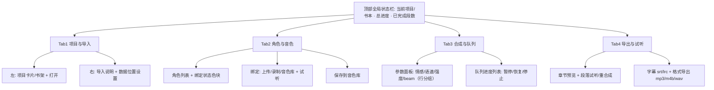
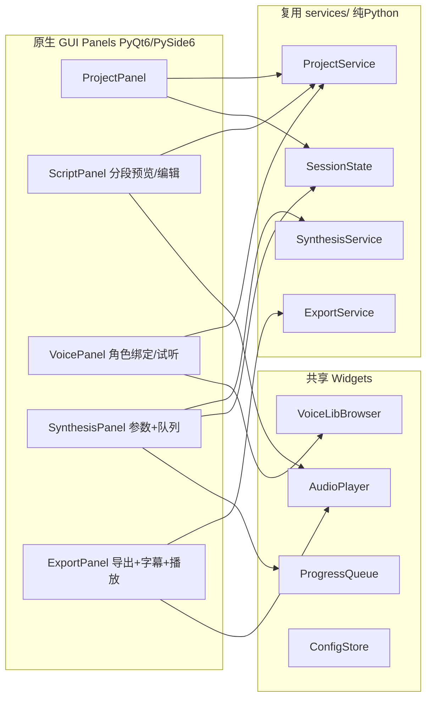

# 调研报告：有声书 TTS 项目功能清单与前端（UI/布局）结构对比

> **调研定位**：本调研是上一轮《开源对比与优化方案》的深化专题，**只聚焦「功能清单 + 前端（UI/布局结构）对比」**，专门挖掘我们前端（路线图 2.3：前端排版重构 / 优化布局）的优化点。
> **不重复**上一轮已锁定的结论（打包走 PyInstaller+pywebview 路线 A 先行、引擎/提速决策等），以下结论与引擎、打包形态无关。
> **对象现状（我们的）**：Gradio 5.x 前端、`services/`（project/synthesis/export/session）已与 UI 解耦；文本分析前置到对话，输出 `structured_script.json`，工作台机械执行；4 个 Tab：① 项目管理 ② 音色配置 ③ 合成控制 ④ 导出。已知体验问题：布局偏堆砌、缺乏信息层级、常用操作点击偏多、存在空白/溢出。

---

## 0. 调研对象与数据来源（均基于真实 Web 查证）

| 项目 | 框架 | 前端形态 | 数据来源 |
|---|---|---|---|
| **ebook2audiobook** | Gradio（版本未公开） | 单页 Web GUI | https://github.com/DrewThomasson/ebook2audiobook |
| **EpubAutomateTTS / NovelTTS** | React 18 + Vite + TS + Tailwind | 多路由 SPA（非 Gradio） | https://github.com/junzhij/EpubAutomateTTS |
| **easyVoice** | Vue 3 + Element Plus（Node/Express 后端） | 多角色 SPA（非 Gradio） | https://github.com/xjx-gentle/easyVoice |
| **ChatTTS-WebUI** | Gradio 4.x `Blocks` | 单页参数面板（注①） | https://github.com/2noise/ChatTTS/blob/main/examples/web/webui.py |
| **Streamlit 类（Multilingual-AI-Audiobook-Narrator）** | Streamlit + FastAPI + Kokoro | 单列线性 UI | https://github.com/krishnapriya-nynaru/Multilingual-AI-Audiobook-Narrator |
| **我们（Audiobook Studio）** | Gradio 5.x | 4 Tab 工作台 | 本地 `app.py` / `services/` |

> **注①**：独立的 `2noise/ChatTTS-WebUI` 仓库在查证时返回 404（疑似已更名/私有）；其参数面板形态以官方 `2noise/ChatTTS` 仓库内 `examples/web/webui.py` 为准（Gradio 4.x `Blocks`，单页、无内部 Tab）。该形态对本报告「参数控件布局」参考最有价值，故采用之。

---

## 1. 功能清单横向对比表

图例：✅ 有　⚠️ 部分/间接有　❌ 无　➖ 不适用

| # | 功能点 | ebook2audiobook | EpubAutomateTTS(NovelTTS) | easyVoice | ChatTTS-WebUI | Streamlit 类 | **我们（当前）** | **差距说明** |
|---|---|---|---|---|---|---|---|---|
| 1 | 文本导入 **txt** | ✅ | ❌ | ✅（文本/小说） | ✅（纯文本） | ✅ | ⚠️（经上游 JSON） | 工作台只吃 `structured_script.json`，txt 由上游对话分析覆盖 |
| 2 | 文本导入 **epub** | ✅（最佳） | ❌ | ❌ | ❌ | ❌ | ⚠️（经上游） | 我们 epub 依赖上游分析，工作台无内置解析 |
| 3 | 文本导入 **md** | ❌ | ✅（仅 md，≤10MB） | ❌ | ❌ | ❌ | ⚠️（经上游） | NovelTTS 以 md 为唯一入口；我们走 JSON 中转 |
| 4 | 文本导入 **docx** | ✅ | ❌ | ❌ | ❌ | ❌ | ⚠️（经上游） | 同上 |
| 5 | **分段策略可视化** | ❌（仅 roadmap） | ✅（预览页章节/片段列表，2000字切片） | ⚠️（AI 分段+流式，未显式可视化） | ❌（强调手动分段） | ❌ | ⚠️（导出页章节完成表） | **差距**：我们仅在「合成后」看分段完成态，无「合成前预览/勾选范围」 |
| 6 | **角色/音色管理** | ⚠️（声音克隆上传 + SML 标签换声，无角色面板） | ✅（AI 识别 + 别名合并 + 角色统一 + 映射） | ✅（多角色配音 + AI 推荐 + 自定义 voice/rate/pitch/volume） | ⚠️（Timbre 下拉 + Audio Seed） | ✅（语言/声音下拉） | ✅（Tab2 角色下拉 + 绑定） | 我们角色由上游给出，缺「别名合并/角色统一」UI（应在上游做） |
| 7 | **情感/韵律控制** | ⚠️（SML 标签 `[break]/[pause]/[voice]`，非情感） | ✅（AI 自动情绪标注，不可手动） | ⚠️（AI 推荐参数模拟） | ✅（refine prompt `[oral][laugh][break]` + temperature/top_P/top_K） | ❌（仅语速） | ⚠️（仅重合成可调 emotion/强度/语速） | **差距**：情感/语速参数只能在「导出→重合成」调，合成阶段不可控 |
| 8 | **批量合成与队列** | ✅（目录批量）⚠️无队列视图 | ⚠️（批量选片段合成，无显式队列） | ✅（分段→分析→生成→拼接；并发限流） | ❌（单次为主） | ❌ | ✅（后台队列 ThreadPoolExecutor）⚠️无队列视图 | **差距**：我们有后台队列但 UI 仅文本日志，无结构化队列/进度列表 |
| 9 | **进度 / 暂停 / 恢复 / 重投** | ⚠️（上传 [X] 取消 + `--session` 恢复；无暂停/重投按钮） | ✅（AI 监控进度 + 音频播放/暂停/下载） | ⚠️（流式播放，未提暂停/重投） | ⚠️（Generate + Interrupt 停止，无暂停/重投） | ❌ | ⚠️（进度条+日志 ✅；停止=取消 ✅；断点续跑 ✅；无暂停；重合成=重投） | **差距**：有「停止/断点续跑」，但无「暂停/恢复」与「队列级重投」 |
| 10 | **试听体验** | ⚠️（下载试听，无内嵌播放器描述） | ✅（片段批量预览 + 播放/暂停/下载） | ✅（流式即时播放，超长文本立刻播） | ✅（AutoPlay + Stream 输出音频） | ✅（`st.audio` + 下载） | ✅（Tab2 角色试听 + Tab4 段落试听） | 我们试听可用，但无「章节级合并试听」 |
| 11 | 导出 **wav** | ✅ | ❌ | ❌（mp3） | ✅ | ✅ | ✅ | 持平 |
| 12 | 导出 **mp3** | ✅ | ✅ | ✅ | ✅ | ❌（wav 示例） | ✅ | 持平 |
| 13 | 导出 **m4b** | ✅（默认） | ❌ | ❌ | ❌ | ❌ | ✅ | 我们优于多数竞品（m4b 有声书容器） |
| 14 | **字幕 srt / lrc** | ❌ | ❌ | ✅（新 commit 加字幕生成） | ❌ | ❌ | ❌ | **关键差距**：我们完全无字幕导出，easyVoice 已支持 |
| 15 | **项目管理（多书/多章）** | ⚠️（目录约定 + session，无书架 UI） | ⚠️（Supabase 存 books/chapters/clips） | ❌（单本流式） | ❌ | ❌ | ✅（Tab1 多项目 + 数据目录） | 我们项目管理反而强于多数竞品 |
| 16 | **配置与数据位置** | `lib/conf.py` + `ebooks/audiobooks/voices/tmp/` | `.env`（Supabase/Kimi/Azure）+ `uploads/audio_output/` | `.env`（PORT/OPENAI/EDGE_API_LIMIT）+ `packages/backend/audio` | 代码内（种子） | `generated_audio/` | `config` 数据目录（默认 `~/AudiobookStudio/`）+ `workspace/projects` + 外置 `voice_library` | 我们数据目录外置、可视化设置，优于多数 |

### 1.1 我们与其他项目的核心差距（Top 5）

1. **字幕 srt/lrc 缺失**：仅 easyVoice 支持，我们为 ❌。这是与「有声书 + 视频二创」场景最直接的差距。
2. **合成阶段不可调情感/语速**：情感/强度/语速参数仅能在「导出→重合成」时调；ChatTTS 在合成即控（refine prompt + temperature），我们的 `structured_script.json` 已带 `emotion/emo_alpha/speech_rate` 字段却未在合成页暴露。
3. **合成进度仅文本日志**：有后台队列但 UI 无结构化「队列 + 进度列表」，对比 easyVoice 流式、NovelTTS 监控页信息层级弱。
4. **无「合成前分段预览/编辑」**：仅合成后看章节完成表；NovelTTS 有「预览页勾选片段」的前置可视化。
5. **角色别名合并 UI 缺失**：NovelTTS 支持；我们角色由上游分析决定，合并逻辑更适合放在对话分析阶段（见优化点 O6）。

> 补：我们**领先**竞品的项——m4b 导出、多项目管理/数据目录外置、结构化脚本驱动（与后端解耦），应作为 2.3 保留资产。

---

## 2. 前端设计结构分析（有 Web UI 的项目）

### 2.1 ebook2audiobook（Gradio 单页）
- **(a) 页面/区块**：单页 GUI，无内部 Tab；核心是「电子书上传组件 + 转换」。CLI 参数（语言、输出格式、voice_map、session）不在 GUI 内。
- **(b) 信息层级**：弱。靠截图示意，无章节/角色/进度区块划分。
- **(c) 点击深度**：极浅（上传 → 转换 → 下载）。
- **(d) 优点/槽点**：优点＝极简、格式覆盖广（epub/mobi/docx/pdf…）；槽点＝无章节管理、无角色面板、无进度可视化、批量靠目录约定。

### 2.2 EpubAutomateTTS / NovelTTS（React 多路由 SPA）
- **(a) 页面/区块**：上传页 → 预览页（章节/片段列表，勾选需 AI 分析的片段）→ AI 分析监控页（角色识别/情绪标注实时进度）→ 音频合成页（角色→音色映射 + 合成 + 下载）。`src/pages/` + `src/components/` 路由驱动。
- **(b) 信息层级**：清晰「阶段式流程」，每阶段一页，上下文聚焦。
- **(c) 点击深度**：约 3–4 步（上传 → 选片段 → 启动分析 → 映射合成）。
- **(d) 优点/槽点**：优点＝阶段分明、预览选片段、AI 自动角色/情绪；槽点＝仅 md 入口、强依赖 Supabase + Kimi + Azure 外部服务、无本地轻量模式。

### 2.3 easyVoice（Vue SPA）
- **(a) 页面/区块**：以「输入区 + 实时流式播放」为核心的单页；角色以 JSON/列表呈现；底部音频与字幕输出。
- **(b) 信息层级**：「输入即产出」线性，弱化多步骤，强调超长文本即时反馈。
- **(c) 点击深度**：1–2 步（粘贴文本 → 生成，流式即时播）。
- **(d) 优点/槽点**：优点＝10 万字一键、流式播放、字幕、多角色 + AI 推荐；槽点＝无多书/项目管理、AI 推荐分段较慢、仅 Azure/Edge 引擎。

### 2.4 ChatTTS-WebUI（Gradio 4.x `Blocks` 单页，参数面板参考）
- **(a) 页面/区块**（据 `webui.py` 真实代码）：文本框(`lines=4`) → 第一行 `Row[Refine 复选 + temperature 滑块 + top_P 滑块 + top_K 滑块]` → 第二行 `Row[Timbre 下拉 + Audio Seed 数字 + 🎲随机 + Text Seed + 🎲随机]` → 第三行 `Row[DVAE 系数 + Reload]` → 第四行 `Row[AutoPlay + StreamMode + Generate(primary) + Interrupt(stop)]` → 输出文本 → 输出音频。
- **(b) 信息层级**：参数**按行分组**（滑块成行、种子配随机骰子按钮、主操作 `Generate` 高亮 + `Interrupt` 红色停止），主次分明。
- **(c) 点击深度**：1–2 步（输入 → 生成）。
- **(d) 优点/槽点**：优点＝参数面板组织极清晰、可直接照搬；槽点＝无 Tab、无批量、无队列（本质是单句 TTS）。

### 2.5 Streamlit 类（Multilingual-AI-Audiobook-Narrator）
- **(a) 页面/区块**：单列线性——文本区 → 语言/声音下拉 → 语速滑块 → 「Generate Audiobook」按钮 → 音频播放器 + 下载按钮。
- **(b) 信息层级**：极简单栏，零学习成本。
- **(c) 点击深度**：1–2 步。
- **(d) 优点/槽点**：优点＝最快上手、FastAPI 后端解耦；槽点＝无章节/角色/批量/字幕，仅为 demo 级。

---

## 3. 对照我们 4 Tab 的差距与优化点

> 每条标注：优化点描述 / 采纳判定（✅采纳 ⚠️待定 ❌不采纳）/ 适用形态（Gradio 精修 / 原生 GUI / 两者通用）/ 预期收益+落地成本 / 参考项目。

| 编号 | 优化点描述 | 采纳判定 | 适用形态 | 预期收益 + 落地成本 | 参考项目 |
|---|---|---|---|---|---|
| **O1** | **导出增加 srt/lrc 字幕生成**（从 segments 时间轴拼字幕） | ✅ 采纳 | 两者通用 | 收益高（补齐核心短板，解锁视频二创）；成本中（需 segments 起止时间，services/export 扩展） | easyVoice |
| **O2** | **合成控制页增加情感/语速/情绪强度参数面板**（而非仅在重合成可调） | ✅ 采纳 | Gradio 精修优先 | 收益中（首合成即可控韵律）；成本中（我们 JSON 已带 emotion 字段，UI 暴露 + 传入 synthesis） | ChatTTS-WebUI（分组）+ 我们已有字段 |
| **O3** | **合成页用「结构化队列 + 进度列表」替代纯文本日志** | ⚠️ 待定 | Gradio 精修 | 收益高（信息层级跃升）；成本中（UI 列表 + SynthesisState 暴露 per-segment 状态） | easyVoice 流式 / NovelTTS 监控 |
| **O4** | **项目管理 Tab 加「书架/项目卡片 + 章节树」可视化** | ⚠️ 待定 | 两者通用 | 收益中（多书导航清晰）；成本中（卡片组件 + 章节树） | NovelTTS 预览页 / Streamlit 卡片 |
| **O5** | **增加「合成前分段预览/编辑」页（看章节/片段、勾选范围）** | ⚠️ 待定 | 两者通用 | 收益高（避免无效合成）；成本中高（新 Tab/Panel + 与 script 联动） | NovelTTS 预览选片段 |
| **O6** | **角色「别名合并/角色统一」UI** | ❌ 不采纳 | 上游（对话分析） | 收益低（当前角色由上游分析产出，合并应在对话阶段做，避免工作台重复） | NovelTTS |
| **O7** | **常用操作收敛 ≤2 点击**（如打开项目后自动载入角色表/合成页状态） | ✅ 采纳 | Gradio 精修 | 收益高（直接消减路线图「点击偏多」）；成本低（事件串联 + 可见性自动切换） | 通用 |
| **O8** | **减空白/溢出**：Row+Column 网格、固定日志高度、组件 `visible` 切换、统一间距 | ✅ 采纳 | Gradio 精修 | 收益中（消除堆砌/空白）；成本低（布局微调，不新增功能） | 通用 |
| **O9** | **音色库增强**：试听播放器 + 分类/搜索 + 拖拽绑定 | ⚠️ 待定 | 两者通用 | 收益中（多音色项目提效）；成本中 | easyVoice 角色列表 |
| **O10** | **多引擎/多音色源切换**（本地+云 TTS） | ❌ 不采纳 | — | 属上轮引擎决策范畴，本轮不展开 | easyVoice |
| **O11** | **顶部全局状态栏**（当前项目/书本 + 总进度 + 已完成段数） | ✅ 采纳 | 两者通用 | 收益中（全局信息层级）；成本低（一行 Markdown/状态条） | NovelTTS 顶部统计 |
| **O12** | **段落级「暂停/恢复」合成**（非仅停止）** | ⚠️ 待定 | Gradio 精修 | 收益中（精细控制）；成本高（队列改造为可暂停 worker） | NovelTTS |
| **O13** | **统一试听播放器**：章节级合并试听 + 段落级试听 | ✅ 采纳 | 两者通用 | 收益中（试听体验一致）；成本中（AudioPlayer 组件复用） | easyVoice / NovelTTS |

**优先落地建议（2.3 第一波）**：O1（字幕）、O2（合成期情感参数）、O7（≤2点击）、O8（减空白）、O11（状态栏）——成本低、收益明确，且 Gradio 精修即可做，不影响路线 B 复用。

---

## 4. 给路线图 2.3 的具体建议

### 4.1 路线 A（Gradio 精修）—— 4 Tab 重排草案

**原则**：顶部全局状态栏 + 4 Tab 信息层级清晰 + 常用操作 ≤2 点击 + Row/Column 网格减少空白溢出。保留我们领先项（m4b、多项目、数据目录外置、结构化脚本驱动）。

- **顶部全局状态栏**：当前项目名 · 总章节/段进度 · 已完成段数（`O11`）。
- **Tab1 项目与导入**（合并原① + 导入说明 + 数据位置）：左栏「项目卡片/书架 + 打开」（可视化，`O4` 轻量版）；右栏导入说明（提示 txt/docx/md/epub 经对话分析 → JSON）+ 数据保存位置（`O7`：打开后自动刷新角色表与合成页）。
- **Tab2 角色与音色**（精修原②）：上部「角色列表 + 绑定状态」（自动识别、状态色块）；中部「绑定：上传/录制/音色库 + 试听」；下部「保存到音色库」（`O9` 轻量版试听播放器）。
- **Tab3 合成与队列**（强化原③）：**参数面板**（`O2`，参考 ChatTTS 行分组：情感下拉 + 情绪强度滑块 + 语速滑块 + beam 下拉，置于醒目 Row）；**结构化队列进度列表**（`O3`：每段状态 ✅/⏳/❌ + 暂停/恢复/停止）；右栏控制区收敛。
- **Tab4 导出与试听**（强化原④）：章节预览表 + 段落试听/重合成（保留）+ **字幕 srt/lrc 开关**（`O1`）+ 格式导出（mp3/m4b/wav 保留）+ 章节级合并试听（`O13`）。

> 布局手法：`gr.Row`/`gr.Column(scale=...)` 定宽网格；日志/列表用固定 `lines` 防溢出；未打开项目时相关组件 `visible=False`（`O8`）。

### 4.2 路线 B（原生 GUI 重写，PyQt6/PySide6）—— 模块划分

**核心**：完全复用现有 `services/`（纯 Python、零 Gradio 依赖）——`ProjectService` / `SynthesisService` / `ExportService` / `SessionState`，前端仅做渲染与事件绑定。

- **ProjectPanel**：项目卡片/书架、打开、数据目录设置 → 调 `ProjectService` + `config`。
- **ScriptPanel（分段预览/编辑）**：渲染 `structured_script.json` 章节/片段树，勾选合成范围 → 读 `ProjectService.open_project`。
- **VoicePanel**：角色列表 + 绑定 + 试听 + 音色库浏览 → 调 `ProjectService.bind_voice` / `save_to_lib`。
- **SynthesisPanel**：参数（情感/语速/beam）+ 队列进度（暂停/恢复/停止）→ 调 `SynthesisService`。
- **ExportPanel**：导出格式 + 字幕 srt/lrc + 合并试听/下载 → 调 `ExportService`。
- **共享 Widgets**：`AudioPlayer`（统一试听，`O13`）、`ProgressQueue`（队列进度，`O3`）、`VoiceLibBrowser`（音色库，`O9`）、`ConfigStore`（数据目录）。

> 这样路线 A 的 UI 重构与路线 B 的面板划分**共享同一套 services 契约与信息层级**，2.3 的精修成果可直接迁移为原生 GUI 的 Panel 规格。

### 4.3 推荐布局结构图（Mermaid）

**路线 A（Gradio 精修）推荐布局**：

**路线 B（原生 GUI）模块划分（复用 services/）**：

---

## 5. 结论速览（给团队 lead）

- **功能差距 Top5**：① 字幕 srt/lrc（仅 easyVoice 有，我们无）② 合成期不可调情感/语速（仅重合成可）③ 合成进度仅文本日志（无队列视图）④ 无合成前分段预览 ⑤ 角色别名合并 UI（宜放上游）。
- **前端结构可借鉴**：ChatTTS-WebUI 的「参数滑块行分组 + 种子随机按钮 + 主生成/停止突出」直接套用合成控制页；easyVoice 的「超长文本流式即时播放 + 字幕」提升试听；NovelTTS 的「阶段路由 + 章节/片段预览列表」做信息层级；Streamlit 单列线性作原生 GUI 基线。
- **2.3 路线 A（Gradio 精修）**：顶部状态栏 + 4 Tab 重排（项目与导入 / 角色与音色 / 合成与队列[参数面板+队列进度] / 导出与试听[字幕+格式]），常用操作≤2点击，Row/Column 网格减空白；首选落地 O1/O2/O7/O8/O11。
- **2.3 路线 B（原生 GUI）**：PyQt6/PySide6，复用 `services/`（project/synthesis/export/session），Panel 划分为 Project/Script/Voice/Synthesis/Export，共享 AudioPlayer/ProgressQueue/VoiceLibBrowser/ConfigStore，与路线 A 共享同一信息层级。

---

## 附录：引用仓库

- ebook2audiobook：https://github.com/DrewThomasson/ebook2audiobook
- EpubAutomateTTS / NovelTTS：https://github.com/junzhij/EpubAutomateTTS
- easyVoice：https://github.com/xjx-gentle/easyVoice （fork 自 cosin2077/easyVoice）
- ChatTTS 官方 WebUI（参数面板参考）：https://github.com/2noise/ChatTTS/blob/main/examples/web/webui.py
- Streamlit 类 Multilingual-AI-Audiobook-Narrator：https://github.com/krishnapriya-nynaru/Multilingual-AI-Audiobook-Narrator
- 我们本地代码：`app.py` / `services/`（project.py / synthesis.py / export.py / session.py）
