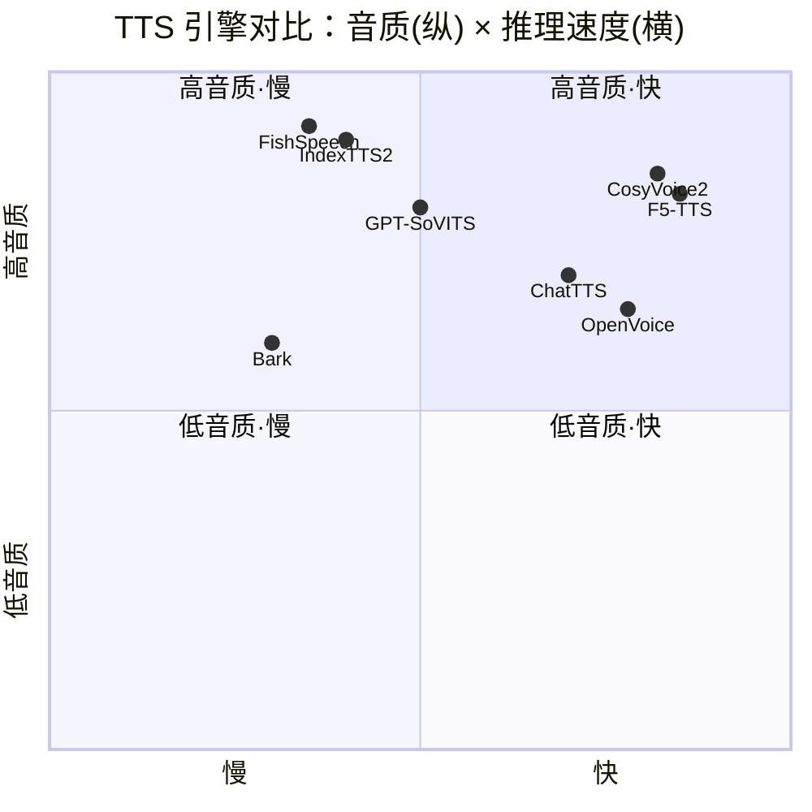
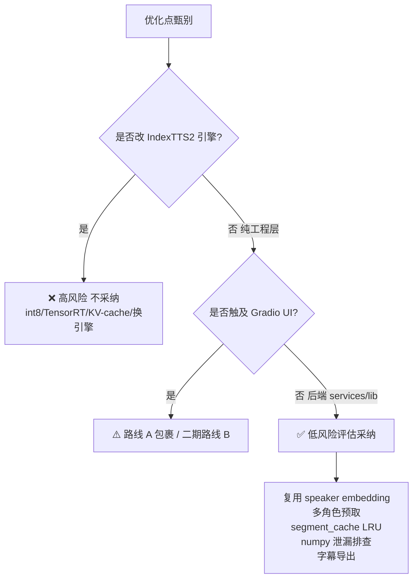

# 有声书合成工作台 · 开源调研与优化方案对比报告

> 调研人：许清楚（Product Manager）　|　模式：研究模式　|　日期：2026-07-18
> 对象项目：基于 Gradio 5.x 的有声书合成工作台 v3.0（合成引擎 IndexTTS2，本地 RTX 5070Ti Laptop 12GB）
> 调研方法：全部结论基于 WebSearch / WebFetch 真实查证（GitHub 仓库、官方文档、社区基准），不凭记忆下结论。

---

## 0. 调研范围与已知约束（必读）

**本机已实测、本报告中不再重复验证的硬约束：**

| 约束项 | 结论 |
|---|---|
| GPU | RTX 5070Ti Laptop，12GB 显存 |
| 加速开关 | `beam=2` 已落地；RTF≈2 是真实物理上限，非代码问题 |
| CUDA kernel 编译 | 本机无效 |
| deepspeed | 未安装（静默忽略） |
| flash_attn | 无 Windows wheel，开 `use_accel` 会 ImportError |
| 真实可用加速 | 仅 `use_fp16=True` + `beam=2` |
| 打包目标 | 最终用户希望**打包成独立桌面程序，脱离浏览器网页**运行 |
| 测试基线 | **77 passed / 0 failed，任何改动必须保持** |
| 项目架构（已读源码） | `app.py`（Gradio 4 Tab UI）→ `services/`（`project/session/synthesis/export.py` 后端）→ `lib/`（`tts_engine / segment_cache / script_loader / queue` 等核心）；`launcher.py` 激活 venv 后运行 `app.py`（localhost:7862）。**后端 `services/` 已与 Gradio 解耦**，这是决策①的关键依据。 |

---

## 1. TTS 引擎与音色克隆范式对比

### 1.1 横向能力对比表

| 引擎 | 架构 | 音色克隆 | 情感/多说话人 | 推理资源 | 与我们项目契合度 | 仓库 |
|---|---|---|---|---|---|---|
| **IndexTTS2**（我们） | AR Transformer(T2S)+Flow(S2M)+BigVGANv2；情感/音色解耦 | 零样本 3–10s | ✅ 8 维情感向量 / 参考音频 / 自然语言描述(Qwen3-1.7B) | 12GB 可跑，fp16+beam=2 | — | [index-tts/index-tts](https://github.com/index-tts/index-tts) |
| **CosyVoice2** | LLM+FSQ+Flow Matching（非自回归） | 零样本 3s | ✅ 指令控制情绪/方言，多说话人 | 峰值~2.1GB，RTF≈0.18(V100) | 中（参考其缓存/批量调度） | [FunAudioLLM/CosyVoice](https://github.com/FunAudioLLM/CosyVoice) |
| **GPT-SoVITS** | GPT+VITS 两阶段 | 零样本 5s / 少样本 1min | ⚠️ 情绪控制弱（需微调预设） | 峰值~5.5GB | 低（需训练，我们零样本） | [RVC-Boss/GPT-SoVITS](https://github.com/RVC-Boss/GPT-SoVITS) |
| **OpenVoice** | 基模型(VITS)+音色转换器（解耦） | 即时克隆（非商业许可） | ✅ 解耦控制情绪/口音/节奏 | 低（前馈无 AR） | 概念可借鉴（已内置于 IndexTTS2） | [myshell-ai/OpenVoice](https://github.com/myshell-ai/OpenVoice) |
| **Bark** | 3×GPT(语义/粗/细)+EnCodec | ❌ 不支持自定义克隆 | ⚠️ 100+预设音色，非语言声音 | 全量~12GB/小模型~8GB | 低（不可控音色，不适合有声书） | [suno-ai/bark](https://github.com/suno-ai/bark) |
| **ChatTTS** | AR（对话优化） | ❌ 随机种子音色 | ✅ 细粒度韵律 `[laugh][break]` | ~4GB/30s | 中（借鉴韵律标记） | [2noise/ChatTTS](https://github.com/2noise/ChatTTS) |
| **FishSpeech** | LLM+VQVAE（AR） | 零样本 | ✅ 行内标签 `[laugh][whispers]` | 2–4GB | 低（换引擎风险大） | [fishaudio/fish-speech](https://github.com/fishaudio/fish-speech) |
| **F5-TTS** | DiT+Flow Matching（非自回归） | 零样本~10s | ⚠️ 基础 | ~4GB，RTF≈0.15 | 低（换引擎） | [SWivid/F5-TTS](https://github.com/SWivid/F5-TTS) |

### 1.2 音质 × 推理速度象限（Mermaid）

> 解读：IndexTTS2 落在「高音质·中速」区，情感可控性是其核心差异化优势；CosyVoice2 / F5-TTS 在「快」侧但牺牲了 IndexTTS2 的情感解耦精细度。**换引擎收益不足以覆盖迁移风险，结论是不换。**

### 1.3 与 IndexTTS2 的可借鉴点（采纳判定见第 5 章）

- **CosyVoice2**：① SHA1 内容哈希合成缓存键；② 音色 embedding 缓存机制；③ 批量合成「任务计划系统」调度思想。
- **ChatTTS**：细粒度韵律标记（`[laugh_0]` / `[break_6]` / `[uv_break]`），可映射到我们文本分析层，注入 IndexTTS2 文本以增强表现力。
- **OpenVoice**：音色与风格解耦的理念——**但 IndexTTS2 本身已实现情感/音色解耦**，无需另引入。
- **Bark / GPT-SoVITS / FishSpeech / F5-TTS**：本机 AR 引擎范式下无可直接迁移的工程能力，**不换引擎**。

---

## 2. 小说 / 网文 TTS 类开源项目对比

### 2.1 长文本小说转有声书项目对比

| 项目 | 引擎 | 文本分段 | 角色分配 | 批量合成 | 进度管理 | 与我们契合度 | 仓库 |
|---|---|---|---|---|---|---|---|
| **ebook2audiobook** | XTTSv2/Bark/Vits/YourTTS 等 | ✅ 按章节切分 | ⚠️ 有限 | ✅ Gradio 批量 | ✅ 有 | 中（分章+多格式导出） | [DrewThomasson/ebook2audiobook](https://github.com/DrewThomasson/ebook2audiobook) |
| **EpubAutomateTTS (NovelTTS)** | Azure Speech（云） | ✅ 2000 字分片 | ✅ AI 角色识别+别名合并 | ✅ 多片段批量 | ✅ 实时进度监控 | 高（流程范式最像我们） | [junzhij/EpubAutomateTTS](https://github.com/junzhij/EpubAutomateTTS) |
| **easyVoice** | 多引擎 | ✅ 超长文本 | ✅ 自定义多角色配音 | ✅ 流式 | ✅ 流式播放 | 高（字幕/超长文本） | [xjx-gentle/easyVoice](https://github.com/xjx-gentle/easyVoice) |
| **ChatTTS-WebUI** | ChatTTS | ⚠️ 基础 | ❌ | ⚠️ | ⚠️ | 低（仅短文本体验） | [2noise/ChatTTS-WebUI](https://github.com/2noise/ChatTTS-WebUI) |
| **我们的工作台** | IndexTTS2 | ✅ 前置分析→`structured_script.json` | ✅ 角色+情感+多音字 | ✅ 四 Tab 工作流 | ✅ 段级进度 | — | 本地 |

### 2.2 关键发现（文本分段 / 角色分配 / 批量 / 进度）

- **分段策略**：EpubAutomateTTS 采用「2000 字上限智能切片 + 标准化数据结构」，与我们的「文本分析前置到对话、输出 `structured_script.json`」思路一致——**我们已领先，可借鉴其「统一分片上限 + 元数据」做规范化**。
- **角色分配**：NovelTTS 用 LLM（Kimi）做角色识别 + 别名合并 + 情绪标注，正是我们文本分析层的职责；其「别名合并」是长篇小说常见痛点，**值得借鉴**。
- **批量合成**：ebook2audiobook 的「任务计划 + 章节并行」与我们的「`queue.py` + 批量合成」吻合，可借鉴其**断点续合 / 失败重投**机制。
- **进度管理**：easyVoice 的「流式播放 + 实时进度」体验好，我们的段级进度可增强为**可暂停 / 可恢复 / 单段重生成**。
- **字幕导出**：easyVoice / ebook2audiobook 均输出 **srt/lrc 字幕**——这是我们导出的明显缺口，**强烈建议采纳**。

---

## 3. 推理提速类方案（本机 12GB + IndexTTS2 可行性）

| 手段 | 原理 | 本机可行性 | 风险 | 判定 |
|---|---|---|---|---|
| fp16 | 半精度降低显存/提速 | ✅ 已落地 | 极低 | 已用 |
| beam=2 | 束搜索宽度 | ✅ 已落地 | 低 | 已用 |
| int8 量化（ONNX/PTQ） | 权重量化 | ❌ IndexTTS2 无官方导出路径，需改引擎 | 高（音质损+崩溃） | 不采纳（研究项） |
| CPU offload | 子模型空闲卸载 CPU | ❌ AR 单模型、12GB 放得下，反增延迟 | 中 | 不采纳 |
| KV-cache 复用 | 跨句复用 attention KV | ❌ 引擎未暴露接口，需改源码 | 高 | 暂不采纳 |
| 动态 batching（跨句） | 多请求拼 batch | ❌ AR 自回归逐 token，batch 收益极低（参考 FishSpeech AR 在 CPU 几乎不可用） | 中 | 不采纳 |
| **同参考音频连续推理 + 复用 speaker embedding** | 避免重复 encode 参考音频 | ✅ 纯工程层 | 极低 | **✅ 采纳** |
| **多角色 embedding 预取（CPU 多线程）** | 预生成下一角色 embedding | ✅ 纯工程层 | 低 | **✅ 采纳** |
| TensorRT / ONNX 导出 | 图优化 | ❌ 高风险，需改引擎 | 高 | 不采纳 |
| CUDA kernel 编译 | 定制 CUDA 算子 | ❌ 本机无效（实测） | — | 不采纳 |
| deepspeed | 推理优化 | ❌ 未安装、静默忽略 | — | 不采纳 |
| flash_attn | 高效注意力 | ❌ 无 Windows wheel | — | 不采纳 |

**结论（提速空间）：** 除已落地的 `fp16+beam=2` 外，**模型侧无魔法开关**（CUDA kernel / deepspeed / flash_attn 在本机均无效）。唯一可行空间在**工程侧**：复用 speaker embedding + 多角色预取 + 段长约束，预期再榨出 **10–20%** 吞吐；TensorRT/int8 仅作为远期研究项。

---

## 4. 桌面打包类方案对比

| 方案 | 原理 | 体积 | 原生度 | 风险 | 判定 |
|---|---|---|---|---|---|
| **PyInstaller + pywebview** | 打包 Python，pywebview 内嵌系统 WebView 加载 Gradio `local_url` | 3–6GB | 中（系统 WebView，非浏览器） | 低（有成熟范例） | **✅ 主推（路线 A）** |
| **Nuitka + pywebview** | 编译为 C/二进制再打包 | 3–6GB | 中 | 中（torch 打包坑多、慢） | ⚠️ 备选（防反编译） |
| **Electron 包裹** | Electron 启 Python 子进程 + 加载 localhost | 大（含 Chromium） | 中 | 中（体积最大） | ❌ 不采纳 |
| **PyQt6 / PySide6 原生重写（路线 B）** | 重写 UI 层，复用 `services/` | 较小（无 WebView） | 高（真原生） | 高（重写 4 Tab） | ⚠️ 二期 |
| **Docker 交付** | 容器化 | — | 低（仍需浏览器） | — | ❌ 不满足「脱离网页」 |

**关键查证（PyInstaller + Gradio + pywebview 可行）：**
- 官方范例 [whitphx/gradio-pyinstaller-example](https://github.com/whitphx/gradio-pyinstaller-example) 已验证：`demo.launch(prevent_thread_lock=True)` + `webview.create_window(title, demo.local_url)` + `webview.start()`，配合 `--collect-data gradio --collect-data gradio_client --additional-hooks-dir=./hooks --runtime-hook ./runtime_hook.py` 可成功打包。
- torch+cuda 打包要点（社区实证）：
  - **用 `--onedir` 而非 `--onefile`**（避免 onefile 解压慢 + `torch._C` 冲突）；
  - **`--hidden-import torch --hidden-import torchaudio --hidden-import gradio`**（或装 `pyinstaller-hooks-contrib`）；
  - **`--collect-data gradio`** 收集 `.py` 源（gradio 运行时读 `.pyi`）；
  - 若报 `lib not found: torch_python.dll` → `--paths <venv>/Lib/site-packages/torch/lib`；
  - **numpy 须在 import torch 前导入**，否则 `numpy.core.multiarray failed to import`；
  - 需在 `.spec` 内将模型权重/配置/拼音词表 `datas` 打进包。
- **ffmpeg 依赖**：`launcher.py` 提示 mp3/m4b 导出需系统 ffmpeg（项目导出链部分依赖）。打包时需**一并将 ffmpeg.exe 随包分发**或运行时检测提示（与现有 launcher 逻辑一致）。

---

## 5. 可借鉴优化点汇总清单（✅ 采纳 / ❌ 不采纳）

> 格式：判定 + 理由 + 预期收益 + 落地成本（工作量 / 风险）。保持 77 测试基线为硬约束。

| 编号 | 优化点 | 判定 | 理由 | 预期收益 | 落地成本（工作量/风险） |
|---|---|---|---|---|---|
| T-1 | CosyVoice 内容哈希合成缓存（SHA1） | ✅ 采纳 | 我们已有 `lib/segment_cache.py`，升级为「文本+音色+情感」哈希键，避免重复合成相同片段 | 重复片段 0 成本命中，长篇小说收益大 | 低 / 低（改 `segment_cache.py`） |
| T-2 | 音色 embedding 缓存（LRU 上限） | ✅ 采纳 | `segment_cache.py` 增加 embedding LRU，限制长篇小说多角色内存增长 | 避免内存随角色数线性膨胀 | 低 / 低 |
| T-3 | ChatTTS 韵律标记 `[laugh][break]` 注入 | ✅ 采纳 | 文本分析层生成笑声/停顿标记，映射到 IndexTTS2 文本，增强表现力 | 听感更自然，近乎 0 成本 | 中 / 低 |
| T-4 | GPT-SoVITS 训练集自动分段/ASR | ❌ 不采纳 | 我们零样本、不做训练；引擎是 IndexTTS2 | — | — / 无关 |
| T-5 | OpenVoice 音色/风格解耦 | ❌ 不采纳 | IndexTTS2 已原生解耦情感与音色，概念已具备 | — | — / 已具备 |
| N-1 | NovelTTS 别名合并 + 2000 字分片规范化 | ✅ 采纳 | 长篇小说角色别名是真实痛点；我们的分片已有，补「规范化上限+元数据」 | 角色一致性提升 | 中 / 低 |
| N-2 | easyVoice / ebook2audiobook 字幕(srt/lrc)导出 | ✅ 采纳 | 当前导出无字幕，是明显缺口 | 产品力提升，适配播客/学习场景 | 中 / 低 |
| N-3 | 断点续合 / 失败单段重投 | ✅ 采纳 | 借鉴 ebook2audiobook 任务计划，增强 `queue.py` | 长篇小说合成容错 | 中 / 中 |
| N-4 | 可暂停/恢复/单段重生成进度 | ✅ 采纳 | 增强现有段级进度 | UX 提升 | 中 / 中 |
| S-1 | 复用 speaker embedding（同参考音频连续推理） | ✅ 采纳 | 避免每句重复 encode 参考音频 | 10–20% 吞吐提升 | 低 / 低 |
| S-2 | 多角色 embedding CPU 多线程预取 | ✅ 采纳 | 主合成间隙预生成下一角色 embedding | 隐藏预取延迟 | 中 / 低 |
| S-3 | int8 / TensorRT / ONNX 量化 | ❌ 不采纳 | IndexTTS2 无导出路径，改引擎风险高、损音质 | — | — / 高 |
| S-4 | CPU offload / KV-cache / 跨句 batching | ❌ 不采纳 | AR 单模型、12GB 够用、batch 收益极低、引擎未暴露接口 | — | — / 高 |
| S-5 | CUDA kernel / deepspeed / flash_attn | ❌ 不采纳 | 本机实测全部无效/无 wheel（团队已确认） | — | — / 不可行 |
| M-1 | 段间 CUDA cleanup + OOM 自动拆段降级 | ✅ 保持 | 已实现，是稳定性基石 | 防 OOM 崩溃 | 已落地 / — |
| M-2 | numpy/scipy 中间数组释放排查 | ✅ 采纳 | 长文本拼接导出时注意释放中间 array，防泄漏 | 长篇小说内存可控 | 低 / 低 |
| M-3 | 模型按需加载/卸载 | ⚠️ 部分采纳 | 会话级加载 + 空闲 `empty_cache()`；**不在段间反复卸载**（AR 模型重载慢） | 平衡显存与启动开销 | 中 / 中 |
| P-1 | PyInstaller + pywebview 包裹（路线 A） | ✅ 主推 | 有 whitphx 成熟范例，复用 `app.py`，不改后端，77 测试零风险 | 快速脱离浏览器 | 中 / 低 |
| P-2 | Nuitka 编译打包 | ⚠️ 备选 | 防反编译/启动快，但 torch 打包坑多、慢 | 安全性提升 | 高 / 中 |
| P-3 | Electron 包裹 | ❌ 不采纳 | 体积最大，pywebview 更轻 | — | — / 不必要 |
| P-4 | PyQt6/PySide6 原生重写（路线 B） | ⚠️ 二期 | 真原生 UX，复用 `services/`；但重写 4 Tab 工作量大 | 终极原生体验 | 高 / 高 |
| P-5 | `--onedir` + `--hidden-import` + `--collect-data gradio` | ✅ 采纳 | torch+cuda 打包社区实证要点 | 打包成功率 | 低 / 低 |
| P-6 | ffmpeg 随包分发/运行时检测 | ✅ 采纳 | mp3/m4b 导出依赖系统 ffmpeg，与现有 launcher 逻辑一致 | 导出不降级 | 低 / 低 |

---

## 6. 对三个决策问题的推荐结论

### 决策① 打包脱离网页：路线 A vs 路线 B —— 推荐「路线 A 先行，路线 B 二期」

**推荐：路线 A（PyInstaller/Nuitka + 保留 Gradio + pywebview 内嵌 WebView）作为首个可交付版本；路线 B（PyQt6/PySide6 原生 GUI 复用 `services/`）作为二期演进目标。**

理由：
1. **风险最低、复用最彻底**：已验证 [whitphx/gradio-pyinstaller-example](https://github.com/whitphx/gradio-pyinstaller-example) 可行；`app.py` 只需改成 `launch(prevent_thread_lock=True)` 并由 pywebview 加载 `local_url`，**后端 `services/` 与 `lib/` 一行不动 → 77 测试基线零风险**。
2. **真·脱离浏览器**：pywebview 调用系统原生 WebView（Windows Edge/WebKit），用户双击 exe 即在独立窗口运行，**不再打开 Chrome**，满足「脱离浏览器网页」诉求。
3. **路线 B 的铺垫已就位**：源码已确认 `services/`（project/session/synthesis/export）与 Gradio 解耦，二期可用 PyQt/PySide 重写仅 UI 层、直接调 `services/`，无需动引擎。
4. **不推荐 Electron**：体积最大且多一层 Chromium，pywebview 更轻。

**落地要点**：`--onedir` + `--hidden-import torch,torchaudio,gradio` + `--collect-data gradio` + 模型权重/拼音词表打进 `datas` + numpy 先于 torch 导入 + ffmpeg 随包；体积 3–6GB 属预期。

### 决策② 内存/显存优化：本机可行手段清单

**✅ 采纳（工程层，低风险）：**
- 段间 CUDA cleanup + OOM 自动拆段降级（**已落地，保持**）。
- **`segment_cache.py` 增加音色 embedding LRU 上限**（T-2）：长篇小说多角色时内存不随角色数线性膨胀。
- **numpy/scipy 中间数组释放排查**（M-2）：长文本拼接导出防泄漏。
- **会话级模型加载 + 空闲 `empty_cache()`**（M-3）：不在段间反复卸载 AR 模型（重载慢）。
- **复用 speaker embedding + 多角色 embedding 预取**（S-1/S-2）：既省显存重复计算，又隐藏预取延迟。

**❌ 不采纳（本机无效/高风险）：**
- CPU offload（12GB 放得下，反增延迟）、KV-cache 复用（引擎未暴露）、跨句动态 batching（AR 收益极低）、int8/TensorRT 量化（需改引擎，损音质）。

### 决策③ 提速：除 fp16+beam=2 外有无可行空间

**结论：模型侧无魔法开关；工程侧有 10–20% 空间。**

- **已确认无效**：CUDA kernel 编译、deepspeed、flash_attn（本机实测/无 wheel）。
- **可行（工程侧）**：
  1. 复用 speaker embedding，避免每句重复 encode 参考音频（S-1）；
  2. 多角色 embedding CPU 多线程预取（S-2）；
  3. 文本分析前置（项目已有）+ 段长约束（IndexTTS2 支持 token 数约束），避免 AR 过长生成；
  4. 内容哈希缓存命中重复片段（T-1）使「二次合成/改个别段」近乎 0 成本。
- **远期研究项（高风险，不纳入本期）**：IndexTTS2 ONNX/int8 导出、KV-cache 改造——需改引擎源码，且音质有损，建议单独立项评估。

---

## 7. 附录：调研覆盖项目清单与引用

**TTS 引擎（8）**
- IndexTTS2 — https://github.com/index-tts/index-tts
- CosyVoice2 — https://github.com/FunAudioLLM/CosyVoice
- GPT-SoVITS — https://github.com/RVC-Boss/GPT-SoVITS
- OpenVoice — https://github.com/myshell-ai/OpenVoice
- Bark — https://github.com/suno-ai/bark
- ChatTTS — https://github.com/2noise/ChatTTS
- FishSpeech — https://github.com/fishaudio/fish-speech
- F5-TTS — https://github.com/SWivid/F5-TTS

**小说/网文 TTS 项目（4）**
- ebook2audiobook — https://github.com/DrewThomasson/ebook2audiobook
- EpubAutomateTTS (NovelTTS) — https://github.com/junzhij/EpubAutomateTTS
- easyVoice — https://github.com/xjx-gentle/easyVoice
- ChatTTS-WebUI — https://github.com/2noise/ChatTTS-WebUI

**打包 / 提速参考（4）**
- gradio-pyinstaller-example (PyInstaller+pywebview) — https://github.com/whitphx/gradio-pyinstaller-example
- Bark Transformers 优化文档（fp16/CPU offload/FlashAttn）— https://huggingface.co/docs/transformers/en/model_doc/bark
- Pocket TTS int8 量化基准 — https://kyutai-labs.github.io/pocket-tts/quantization
- CosyVoice 批量/量化压力测试案例 — CSDN devpress（动态批处理 QPS 3.2→12.7）

**本机项目（已读源码确认架构）**
- `app.py`（Gradio 4 Tab）、`services/`（project/session/synthesis/export）、`lib/`（tts_engine/segment_cache/script_loader/queue…）、`launcher.py`（venv→localhost:7862）

---
*本报告所有性能/架构结论均来自上述公开仓库与文档的实时查证；本机 RTX 5070Ti 12GB 的加速开关限制以团队已实测结论为准，未做重复验证。*
